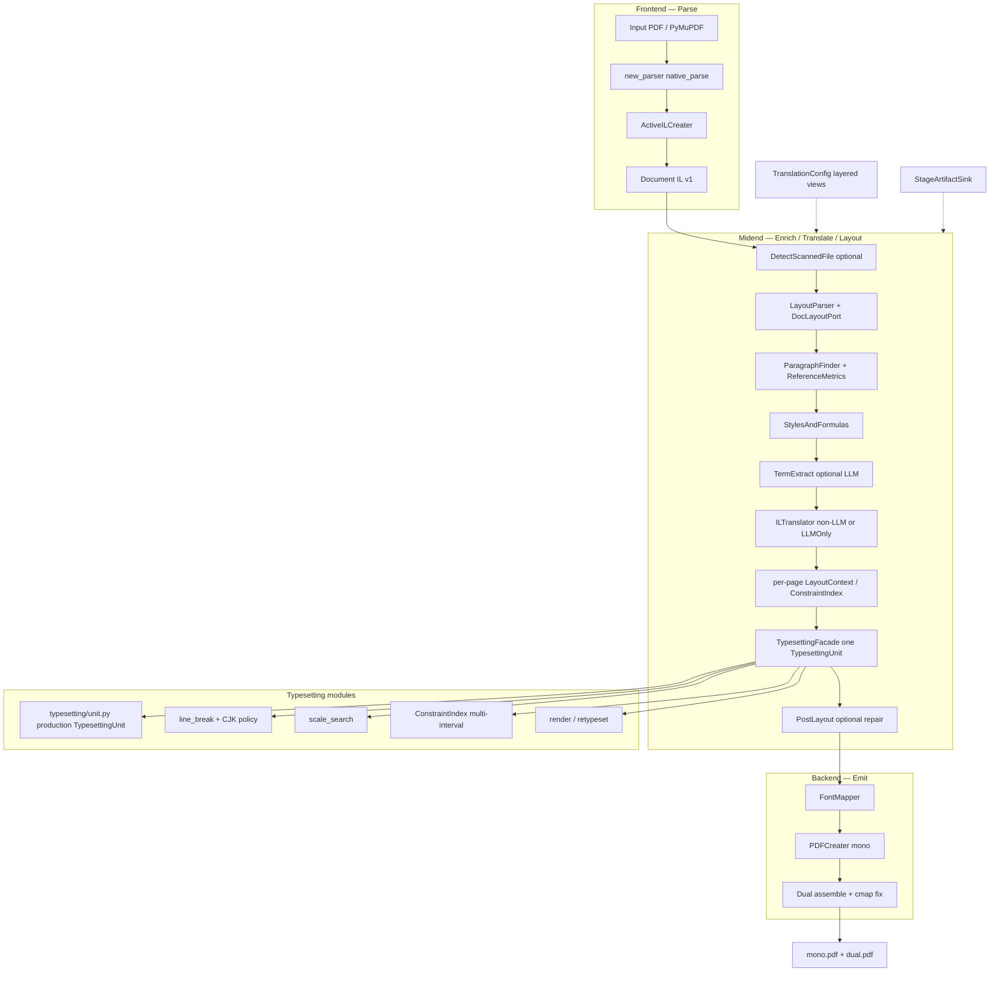
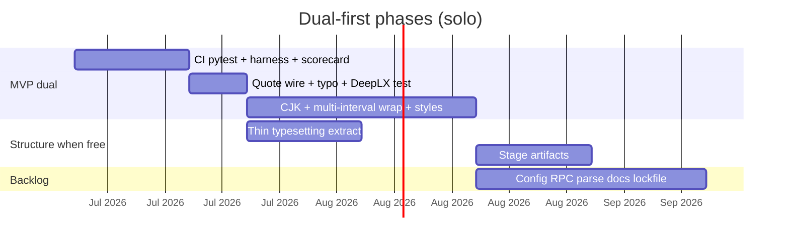
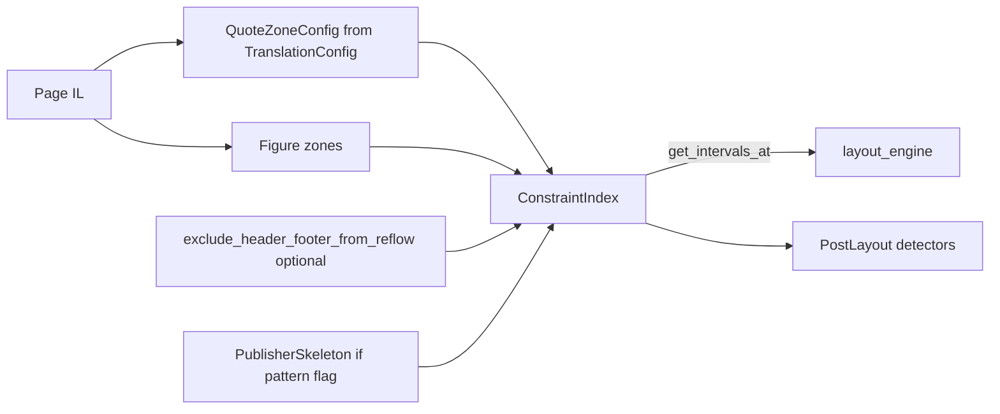
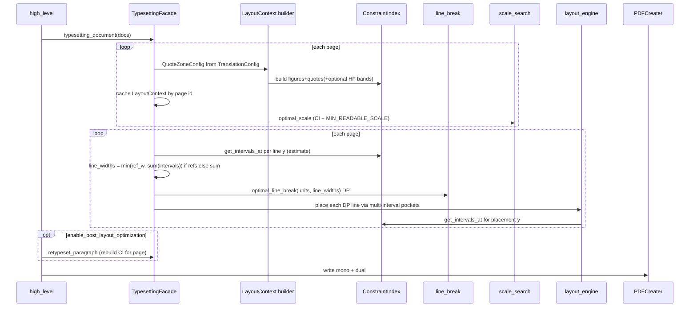
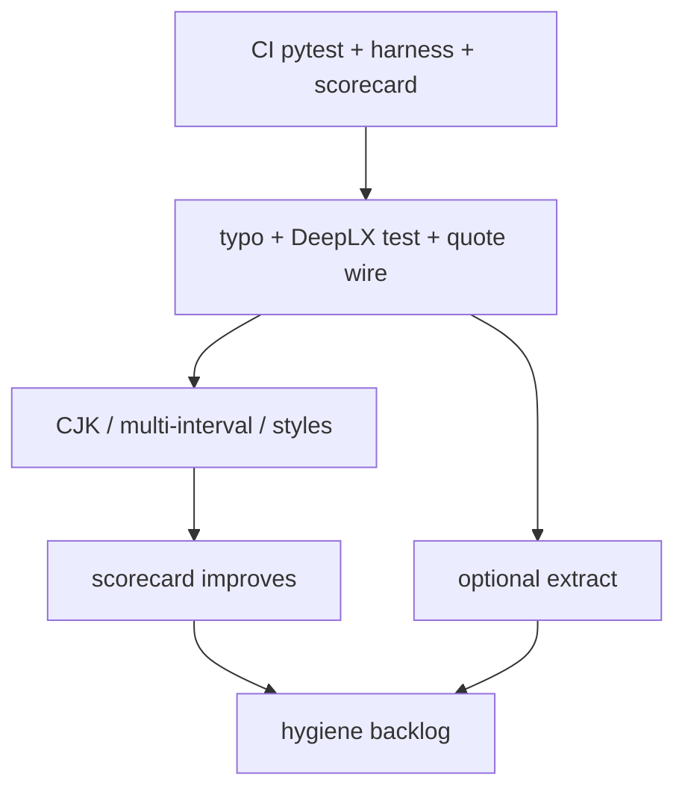
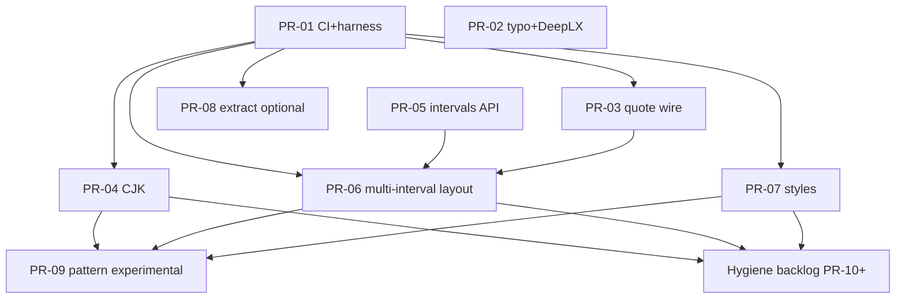

# BabelDOC Overall Architecture Optimization Plan

| Field | Value |
|-------|-------|
| **Document title** | BabelDOC Overall Architecture Optimization Plan |
| **Author** | _TBD_ |
| **Date** | 2026-07-16 (rev 4 system backlog 2026-07-20) |
| **Status** | Draft (rev 4 — post-freeze system backlog: S1–S3 / I/L/C/T/H) |
| **Repo** | `/Users/yun/workspace/BabelDOC` (fork TopCircle/BabelDOC) |
| **Baseline commit** | `312c6b8` (`fix: keep space glyph in ToUnicode`) |
| **Upstream** | funstory-ai/BabelDOC |
| **Primary consumer** | PDFMathTranslate-next (`TranslationConfig` + `async_translate`) |
| **Operator profile** | Solo maintainer; dual-PDF quality + DeepLX (non-LLM) path |

---

## Overview

BabelDOC translates PDFs through a multi-stage pipeline that parses content into a mutable Intermediate Language (IL), enriches layout and paragraphs, translates text, retypesets into target-language geometry, and emits mono/dual PDFs. The architecture is sound at the macro level — **Document IL as the spine, midend stages as processors, PyMuPDF for I/O** — but midend quality work has piled overlapping subsystems into a single god stage (`Typesetting`, ~3116 LOC) while parallel layout modules (`exclusion_zone`, `flow_skeleton`, `pattern_dispatch`, `layout_composer`, `post_layout_processor`) partially duplicate responsibility. Pattern/composer code is **not on the production path** (`high_level.py` does not import it); debug/helper imports remain (`FlowDebugSvg`, `exclusion_zone` → `flow_skeleton.get_paragraph_font_size`).

This document is a **multi-phase architecture optimization roadmap**, not a single feature design. It prioritizes **dual-PDF visual quality and stability** (Orgasms-class publisher layouts), **reproducible/debuggable midend stages**, and **safe incremental refactors** that never break the non-LLM / DeepLX path used by PDFMathTranslate-next.

**Solo capacity rule:** dual quality wins. The published plan has an **MVP dual-quality slice** (Section “MVP PR slice”) and a **hygiene backlog**. Full modularization is desirable but **not a gate** for CJK/wrap/style/quote fixes.

---

## Background & Motivation

### Current pipeline (verified)

Production path is `_do_translate_single` in [`babeldoc/format/pdf/high_level.py`](babeldoc/format/pdf/high_level.py) (~1226 LOC). Stage weights live in `TRANSLATE_STAGES`:

```
Parse PDF → IL (new_parser + ActiveILCreater)
  → DetectScannedFile (optional; skip_scanned_detection)
  → LayoutParser (docvision ONNX / rpc_doclayout*)
  → TableParser (dead: table_model forced None in TranslationConfig)
  → ParagraphFinder
  → StylesAndFormulas
  → [debug] FlowDebugSvg
  → AutomaticTermExtractor (LLM only, optional)
  → ILTranslator | ILTranslatorLLMOnly  (via translator_supports_llm → do_llm_translate)
  → [debug] AddDebugInformation
  → [optional] watermark first-page branch (see known bug: typsetting_document)
  → Typesetting.typesetting_document
  → PostLayoutProcessor (enable_post_layout_optimization)
  → PDFCreater (FontMapper + mono/dual + subset + save)
```

**Core abstraction:** Document IL in [`babeldoc/format/pdf/document_il/il_version_1.py`](babeldoc/format/pdf/document_il/il_version_1.py) (~1401 LOC) — `Document` → `Page` → `PdfParagraph` / figures / fonts / curves, with runtime-only fields such as `ReferenceMetrics`, `alignment`, `optimal_scale`.

**Consumer contract:** PDFMathTranslate-next builds `BabelDOCConfig` via `inspect.signature(TranslationConfig.__init__)` for forward-compatible kwargs and drives `babeldoc.format.pdf.high_level.async_translate`. Translators are **duck-typed** (often `pdf2zh_next` CLI translator objects, not necessarily subclasses of `babeldoc.translator.BaseTranslator`). Non-LLM / DeepLX-style engines fail `do_llm_translate(None)` with `NotImplementedError` → `translator_supports_llm` false → **`ILTranslator`**.

**Existing tests / CI gap:**

- ~15 unit modules under `tests/` (~4k LOC) covering exclusion zones, CJK break, flow skeleton, post-layout, ToUnicode space, etc.
- CI [`.github/workflows/checks.yml`](.github/workflows/checks.yml) runs ruff, `uv sync`/`uv build`, import/CLI smoke, and **`--only-parse-generate-pdf` E2E only — no `pytest`**.
- Large fixtures already in tree: Orgasms PDF ~9.1MB, Module 1 ~2.8MB, dual outputs much larger (local-only scorecard material).

### Size map (LOC, approximate)

| Component | Path | LOC |
|-----------|------|-----|
| Typesetting | `document_il/midend/typesetting.py` | **3116** |
| PDFCreater | `document_il/backend/pdf_creater.py` | 1770 |
| ILTranslator | `midend/il_translator.py` | 1650 |
| ActiveILCreater | `frontend/il_creater_active.py` | 1624 |
| ILCreater (legacy frontend) | `frontend/il_creater.py` | 1450 |
| IL schema | `il_version_1.py` | 1401 |
| StylesAndFormulas | `midend/styles_and_formulas.py` | 1367 |
| PostLayoutProcessor | `midend/post_layout_processor.py` | 1334 |
| high_level | `format/pdf/high_level.py` | 1226 |
| ParagraphFinder | `midend/paragraph_finder.py` | 1201 |
| flow_skeleton | `midend/flow_skeleton.py` | 951 |
| exclusion_zone | `midend/exclusion_zone.py` | 681 |
| TranslationConfig | `format/pdf/translation_config.py` | 631 |
| layout_composer | `midend/layout_composer.py` | 563 |
| pattern_dispatch | `midend/pattern_dispatch.py` | 497 |
| rpc_doclayout + 2…8 | `docvision/rpc_doclayout*.py` | **~2990 total** |
| vendored pdfminer | `babeldoc/pdfminer/` | large, frozen-ish |

### Pain points (architecture review, confirmed in tree)

1. **Typesetting monolith + overlapping layout systems**
   - Production: `Typesetting` + `ExclusionZoneBuilder` / `ExclusionZoneIndex` (wired in `typesetting_document`, `preprocess_document`, `_layout_typesetting_units`).
   - Parallel: `flow_skeleton` → `PatternDispatcher` / `PatternComposer` → `ConstraintComposer` — **not imported by `high_level.py`**; unit-tested; debug path runs `FlowDebugSvg`; `exclusion_zone` already imports `get_paragraph_font_size` from `flow_skeleton`.
   - **Two `TypesettingUnit` types:** production class in `typesetting.py` (~L204, used by `line_break_optimizer`); simplified dataclass in `layout_composer.py` (~L33). Pattern promotion that uses the composer unit will **not** share production break/scale/font behavior.
   - Optional post-pass: `PostLayoutProcessor` (overlap/quote fix via `retypeset_paragraph`).

2. **Known integration bugs (quality-relevant, not just hygiene)**
   - **Quote config not on main typesetting path:** `TranslationConfig.quote_*_threshold` is passed only into `PostLayoutProcessor` (`high_level.py`). `ExclusionZoneBuilder.build(page)` is called **without** `QuoteZoneConfig`, so production quote zones always use `QuoteZoneConfig()` defaults. Consumer already sniffs and forwards quote thresholds — operators can configure values that only affect the optional post-layout path.
   - **Watermark-Both typo:** main path calls `typesetting_document`; watermark helper still calls `Typesetting(...).typsetting_document(...)` (`high_level.py` ~L1145) but **only `typesetting_document` exists** → `AttributeError` when `WatermarkOutputMode.Both`.
   - **Header/footer semantics are translation-only today:** `skip_header` / `skip_footer` / heights are consumed by **`ILTranslator`** to skip translating those paragraphs — **not** by `ExclusionZoneBuilder` or typesetting. `flow_skeleton` / `flow_debug_svg` use a hard-coded ~5% band independent of config heights. Must not conflate “skip translate” with “exclude from reflow intervals.”

3. **Figure wrap under-specified in current engine vs defects doc**
   - Production only calls `get_available_x_range` (single interval). Multi-interval exists on `PublisherSkeleton.get_intervals_at` / `ConstraintComposer` (unwired path).
   - Partial figure handling already exists (zones for figures, scale-floor `MIN_READABLE_SCALE = 0.55`, drop-figures retry). Defect #2 requires multi-interval layout + paragraph-box semantics — not just “honor intervals harder.” See [`docs/layout-engine-defects.md`](docs/layout-engine-defects.md).

4. **Weak stage contracts**
   - Every stage mutates the same `il_version_1.Document`.
   - Debug dumps exist only when `debug=True`; no formal stage I/O schema or golden IL snapshots.
   - `ReferenceMetrics` is an implicit cross-stage contract.

5. **Parse dual-stack**
   - Production: `new_parser` → `parse_prepared_pdf_with_new_parser_to_legacy_ir` + `ActiveILCreater`.
   - Leftover: `legacy_parse.py`, `babeldoc/pdfminer/`, `ILCreater`.

6. **`TranslationConfig` bloat (~631 LOC)** + consumer signature sniffing.

7. **`rpc_doclayout` proliferation**
   - Modules: `rpc_doclayout.py` … `rpc_doclayout8.py` (~2990 LOC).
   - CLI: **seven** mutually exclusive flags `--rpc-doclayout` … `--rpc-doclayout7` in `main.py`.
   - **v8 is executor/gateway-only** (`babeldoc/tools/executor`), not a CLI flag.

8. **Progress stage weights** LLM-centric; TableParser still weighted while `table_model` is always `None`.

9. **Docs out of date** (yadt paths); **no `uv.lock`** though CI cache glob references it.

10. **Consumer table-translation footgun:** PDFMathTranslate-next still constructs `RapidOCRModel()` when `translate_table_text` is set and passes `table_model=…`; BabelDOC forces `table_model = None` and logs deprecation. Table translation is **unsupported in this fork** until revived.

### Why change now

- Orgasms-class dual PDFs are the acceptance criteria; ad-hoc fixes in `typesetting.py` have diminishing returns without constraint clarity.
- Parallel layout modules risk bitrot or mass regressions if naively swapped in.
- Solo capacity requires **MVP dual-quality PRs first**, not a 20-PR ceremony track.

---

## Goals & Non-Goals

### Goals

1. **Dual PDF visual quality & stability** as the primary success metric (scorecard + regression gates).
2. **Land quality fixes without waiting on full modularization** if Phase 1 slips (documented exception).
3. **One production layout constraint model** (`ConstraintIndex` evolving from `ExclusionZoneIndex`) with multi-interval API.
4. **One production `TypesettingUnit`** — composer duplicate is dead/shim only.
5. **Stage contracts + midend debuggability** (when capacity allows after dual gains).
6. **Preserve DeepLX / non-LLM path:** duck-typed translators; `translator_supports_llm` / `do_llm_translate` probe unchanged.
7. **Preserve PDFMathTranslate-next embed surface:** additive `TranslationConfig` kwargs, `async_translate` events.
8. **Reproducible operator builds:** commit `uv.lock` on this fork; `uv sync` as supported install.
9. **Wire existing unit tests into CI** as the first CI improvement.

### Non-Goals

| Non-goal | Rationale |
|----------|-----------|
| Full IL schema rewrite | High risk, low short-term dual ROI |
| Greenfield parser | Production already on `new_parser` |
| Rewriting translator cache / OpenAI client | Orthogonal |
| Multi-tenant SaaS / plugin marketplace | Solo focus |
| Unifying remote DocLayout into one hosted product | Adapter + profiles enough |
| Replacing ONNX DocLayout | Integration, not model R&D |
| Perfect academic typesetting | Readable stable duals is the bar |
| Forcing LLM-only translation | DeepLX first-class |
| Completing all hygiene PRs before dual gains | Capacity |

### What NOT to rewrite (freeze / leave alone)

- **`il_version_1` field names** (additive-only).
- **`BaseTranslator` / duck-typed translator method contracts** (`translate`, `do_llm_translate`, cache hooks).
- **`async_translate` event types**.
- **Working dual-PDF assembly shapes** (`create_side_by_side_dual_pdf` / alternating) — fix bugs (cmap, watermark call), don’t redesign product shape.
- **Vendored `babeldoc/pdfminer`** until legacy retirement.
- **`AutomaticTermExtractor` / `ILTranslatorLLMOnly` internals** beyond keeping them optional.
- **PDFMathTranslate-next** itself — keep BabelDOC APIs signature-sniff friendly.

---

## Proposed Design

### Target architecture



### Design principles

1. **IL remains the single document truth.**
2. **Stages are ordered callables on `Document`** with documented pre/post conditions.
3. **Typesetting is a facade** — external API: `typesetting_document`, `retypeset_paragraph` (and fix typo call site).
4. **One constraint index on the production path** — figures, quotes (from config), optional layout bands. Pattern skeleton is opt-in experimental.
5. **Translation skip ≠ layout exclusion** — separate flags/semantics.
6. **Quality gates before architecture purity** — MVP dual slice first.
7. **Config additive only** — internal views optional later.

### MVP dual-quality slice (solo stop-the-line)

Ship **only** this before hygiene:

| Order | Work | Dual impact |
|-------|------|-------------|
| M1 | CI: run existing `pytest` + tiny harness scaffold | Gate |
| M2 | Fix `typsetting_document` typo; DeepLX dispatch guard test | Correctness |
| M3 | Wire `QuoteZoneConfig` from `TranslationConfig` into main typesetting | Quote/wrap |
| M4 | CJK line-break cost + kinsoku (may land on god file if extract slips) | CJK pages |
| M5 | Multi-interval `get_intervals_at` + production estimate→DP→place (PR-05/06) | Figure wrap |
| M6 | Paragraph style (alignment / first-line indent) consistency | Style |
| M7 | Optional thin extract of pure helpers / package (not blocking M4–M6) | Maintainability |

**Backlog if capacity (not dual MVP):** config views, RPC profiles, legacy parse deprecate, progress weights, lockfile (lockfile is quick — may sneak in early), docs refresh, pattern flag, post-layout default-on eval, delete legacy.

### Post-freeze system backlog (2026-07-20)

**Context:** dual-layer `font.unknown` CJK mid-word / citation EOL work is **operator-frozen**
(F1–F4 in [`tests/golden/SCORECARD.md`](../tests/golden/SCORECARD.md)). Do **not** schedule more
glue/dict/pull-back patches on that track until a redesign. Below is the **system-level**
queue: multi-PDF, architecture-shaped, independent of F1–F4.

**Operator checklist mirror:** SCORECARD § *Post-freeze backlog (system)*.

#### Recommended next three

| Order | ID | Work | Dual / quality impact |
|------:|----|------|------------------------|
| 1 | **S1** | CI `pytest` + FixedMap + IL fingerprint | ✅ done |
| 1b | **S1.1** | Dual text-layer metrics (`--dual`); shared crush/gap helpers | ✅ done (ruler for later layout PRs) |
| 2 | **S2** | Wire `QuoteZoneConfig` into **main** typesetting; fix `typsetting_document` watermark typo | ✅ done (`3b50f52`, `80ec6cf`) |
| 3 | **S3** | Multi-interval: **identical** capacity for estimate → DP → place; `DP_REJECT` logs | ✅ done (`_line_capacity_like_place`) |

**S1 / S1.1 / S2 / S3 complete.** Next system layout items: **L3** (align/indent), **L4** (header skip vs reflow), then optional S1.2 metrics.

Map onto MVP slice: S1≈M1/P0a fingerprint; S1.1 = dual PDF metrics (not full P0b ONNX E2E — that remains non-goal); S2 quote wire; S3 closed-loop capacity.

#### Full ID table

| ID | Area | Task | Notes |
|----|------|------|--------|
| I1 | Infra | Wire pytest into CI | No large dual PDFs in default CI |
| I2 | Infra | dual harness / IL fingerprint | Refactor vs quality gates |
| I3 | Infra | Stage observability (time, greedy/DP, scale) | Operator debug |
| I4 | Infra | Consumer pins editable fork tip | Process |
| L1 | Layout | Quote config on production exclusion zones | Not post-layout-only |
| L2 | Layout | Multi-interval estimate/DP/place closed loop | = S3 |
| L3 | Layout | Paragraph style contract (align/indent/scale) | OCR vs born-digital explicit |
| L4 | Layout | Header/footer: translate skip ≠ layout exclude | Semantics |
| L5 | Layout | Optional single layout path under `ocr_workaround` | Structural alternative to if-stacks |
| C1 | Correctness | Watermark Both `typsetting_document` typo | Hard bug |
| C2 | Correctness | Dead `table_model` vs consumer RapidOCR | Honest config |
| C3 | Correctness | DeepLX / non-LLM dispatch guard test | ILTranslator path |
| T1 | Structure | Thin extract helpers from typesetting god file | M7; non-blocking |
| T2 | Structure | One TypesettingUnit type | Drop composer duplicate |
| T3 | Structure | Pattern path: ship or experimental/ | Dual-stack cleanup |
| T4 | Structure | DP cost + place share width model | Substrate for future CJK redesign |
| H1–H5 | Hygiene | Config views, RPC collapse, progress weights, uv.lock, parse freeze | When free |

#### Explicitly deferred

- F1–F4 font.unknown mid-word / `第11卷（` patch iteration  
- Figure golden re-baseline mixed into dual-layer PRs  
- OCR-only mega if-ladders without replacing the layout strategy  

### Phase roadmap (revised for capacity)



Phases below keep the P0–P5 naming for continuity; **P2 quality work is allowed on the god file** if P1 extract is incomplete (Key Decision K13).

---

### Phase 0 — Dual quality harness + CI substrate

**Intent:** Measurable dual quality; use existing unit tests as substrate.

#### P0a — Wire pytest into CI (immediate)

- Extend `.github/workflows/checks.yml` with `uv run pytest tests/ -q --ignore=…` for unit suite (no large PDF dual by default).
- Keep existing parse-only E2E smoke.
- Do **not** require Orgasms in CI.

#### P0b — Harness contract (implement in PR-01)

| Item | Spec |
|------|------|
| **Entry** | `python -m babeldoc.tools.dual_quality_check --input PATH [--pages 1,2] [--mode il\|ssim\|both]` |
| **Translator** | `FixedMapTranslator` (below) or `skip_translation=True` for layout-only paths |
| **Layout** | Default: local ONNX `DocLayoutModel.load_available()`; optional `--layout-json` recorded boxes for determinism |
| **DPI** | Pixmap compare at **DPI=72** (fast) and optional **DPI=144** for scorecard |
| **Refactor gate (default for extract PRs)** | **IL layout fingerprint** via `il_layout_fingerprint(doc)` (below) + text-layer checks (no SOH-as-space; space glyph) |
| **Quality gate (CJK/wrap/style PRs)** | **SSIM ≥ 0.98** vs previous golden PNGs for listed pages, **or** intentional golden update with scorecard note; pin `pymupdf` in CI/lock |
| **Failure UX** | Print `page_index`, defect class, paths to `actual.png` / `expected.png` / `diff.png` under working dir |
| **Mono vs dual** | Default assert **dual** side (operator KPI); `--also-mono` optional |
| **Fixtures** | Tiny synthetics under `tests/golden/synth/` (left-figure, mid-figure, CJK para, quote column, header band). Large Orgasms/Module-1 **local scorecard only** — do not commit multi-10MB dual binaries to public upstream PRs |

##### FixedMapTranslator (PR-01 skeleton)

Duck-typed like PDFMathTranslate-next CLI translators (not necessarily a `BaseTranslator` subclass). Minimum surface:

```python
class FixedMapTranslator:
    name = "fixedmap"  # ≤20 chars (cache CharField limit)
    def __init__(self, mapping: dict[str, str], lang_in="en", lang_out="zh-CN"):
        self.lang_in, self.lang_out = lang_in, lang_out
        self._map = mapping
        self.ignore_cache = True
    def translate(self, text, ignore_cache=False, rate_limit_params=None):
        return self._map.get(text, text)  # identity fallback for unmapped
    def do_translate(self, text, rate_limit_params=None):
        return self.translate(text)
    def do_llm_translate(self, text, rate_limit_params=None):
        raise NotImplementedError  # forces ILTranslator path
    # optional no-ops: add_cache_impact_parameters, llm_translate absent is OK
```

##### IL layout fingerprint (refactor gate canonicity)

```python
def il_layout_fingerprint(doc: Document) -> str:
    """Stable hash of post-typeset geometry. Not full IL dump."""
    rows = []
    for page in sorted(doc.page, key=lambda p: p.page_number or 0):
        paras = sorted(
            page.pdf_paragraph or [],
            key=lambda p: (p.debug_id or "", p.box.y2 if p.box else 0, p.box.x if p.box else 0),
        )
        for para in paras:
            for comp in para.pdf_paragraph_composition or []:
                for ch in _iter_positioned_chars(comp):  # only chars with valid box
                    b = ch.box
                    rows.append(
                        f"{page.page_number}|{para.debug_id}|"
                        f"{round(b.x,3)},{round(b.y,3)},{round(b.x2,3)},{round(b.y2,3)}|"
                        f"{ch.char_unicode or ''}"
                    )
    return hashlib.sha256("\n".join(rows).encode()).hexdigest()
```

**Rules:** only **positioned** composition characters after Typesetting (skip empty/formula-only if no box); boxes rounded to **3 decimal places**; paragraphs sorted by `debug_id` then geometry; do **not** include full unicode strings of whole paragraphs (mapping drift) or runtime-only fields (`optimal_scale` optional separate assert). Prefer a dedicated helper over raw `XMLConverter` dumps (XML field order / None serialization can flake).

#### P0c — Operator scorecard (`tests/golden/SCORECARD.md`)

| Doc | Pages (0-based or PDF page # — lock in SCORECARD) | Defect class | Rating |
|-----|---------------------------------------------------|--------------|--------|
| Orgasms | *fill with known-bad pages e.g. figure wrap / scale floor pages* | figure_wrap / cjk_ragged / quote / style | 1–5 |
| Module 1 | *fill* | same | 1–5 |

**Rating scale:** 1 = unreadable/broken; 3 = usable with defects; 5 = near original.  
**Pass for quality PR:** target pages improve ≥1 point **or** SSIM improves without regressions on full-text pages; artifacts: before/after PNG + optional IL dump in working dir.  
**Mode:** FixedMap or frozen translation cache so layout is the variable — not DeepLX drift.

#### P0 success criteria

- CI runs **unit tests** + tiny synthetic dual/IL checks on every PR.
- Comparator rules **decided** (IL hash for refactors; SSIM for quality) — see Key Decision K14.
- Local Orgasms checklist documented; not required for CI green.
- Scorecard template committed under `tests/golden/`.

**Dual-quality impact:** Indirect but mandatory.

---

### Phase 1 — Typesetting modularization (optional for dual MVP)

**Intent:** Split the 3116-LOC god file when capacity allows; **not a hard gate for M4–M6**.

**Preferred extract strategy (low churn):**

1. **One mechanical package PR** (or two max): pure helpers first (`merge_cjk_units`, `LINE_BREAK_REGEX`, `MIN_READABLE_SCALE`), then move `TypesettingUnit` + `Typesetting` into `typesetting/` package with stable re-exports.
2. Avoid three sequential wide import-churn PRs for zero user value.

**Target layout** (if/when extracted):

```
typesetting/
  __init__.py          # re-export Typesetting, TypesettingUnit
  facade.py
  unit.py              # THE production TypesettingUnit
  line_break.py
  scale_search.py
  layout_engine.py     # _layout_typesetting_units (+ multi-interval later)
  paragraph_style.py
  fonts.py
```

**Duplicate unit policy:** `layout_composer.TypesettingUnit` marked `# deprecated: use typesetting.TypesettingUnit` and deleted or aliased when experimental pattern path is touched (**PR-09**). Pattern path **must** import production unit or remain forever experimental.

**Public API stability:**

- `from babeldoc.format.pdf.document_il.midend.typesetting import Typesetting`
- `retypeset_paragraph` for PostLayout
- Fix watermark call site to `typesetting_document` (MVP M2 — independent of extract)

**Phase 1 merge rule:** IL snapshot hashes stable (K14); not pixmap-identical required.

**Dual-quality impact:** Enabling only.

---

### Phase 2 — Layout constraints + dual quality core

**Intent:** Fix quote wiring, multi-interval wrap, CJK, styles — production path.

#### 2.0 Data structures: `LayoutContext` / `ConstraintIndex`

```python
@dataclass
class LayoutContext:
    """Per-page layout inputs for typesetting + post-layout. Not serialized to IL."""
    page_index: int
    constraint_index: ConstraintIndex  # evolves ExclusionZoneIndex
    quote_config: QuoteZoneConfig      # existing exclusion_zone.QuoteZoneConfig instance
    # Optional experimental (only if enable_pattern_layout):
    skeleton: PublisherSkeleton | None = None
    pattern_match: PatternMatch | None = None
```

**`QuoteZoneConfig`:** use the **existing** class in `exclusion_zone.py` — do **not** redefine a reduced dataclass. Production fields:

| Field | Source when wiring from `TranslationConfig` |
|-------|-----------------------------------------------|
| `narrow_threshold` | `config.quote_narrow_threshold` |
| `indent_threshold` | `config.quote_indent_threshold` |
| `right_margin_threshold` | `config.quote_right_margin_threshold` |
| `left_margin`, `top_margin`, `bottom_margin` | **leave defaults** (adaptive padding path unchanged) |

```python
from babeldoc.format.pdf.document_il.midend.exclusion_zone import QuoteZoneConfig

quote_config = QuoteZoneConfig(
    narrow_threshold=config.quote_narrow_threshold,
    indent_threshold=config.quote_indent_threshold,
    right_margin_threshold=config.quote_right_margin_threshold,
    # margins: omit → class defaults
)
```

```python
class ConstraintIndex:  # rename/alias of ExclusionZoneIndex
    def get_intervals_at(
        self,
        y_bottom: float,
        y_top: float,
        default_x: float,
        default_x2: float,
        min_width: float | None = None,
    ) -> list[tuple[float, float]]:
        """All residual x intervals L→R after subtracting zones; each width ≥ min_width.
        If every residual is thinner than min_width, return [] (caller applies fallback).
        """
        ...

    def get_available_x_range(
        self,
        y_bottom: float,
        y_top: float,
        default_x: float,
        default_x2: float,
        min_width: float | None = None,
    ) -> tuple[float, float]:
        """Single-interval API — **behavior-compatible with today's implementation**.
        NOT a pure max(width) over get_intervals_at. See policy table below.
        """
        ...
```

##### `get_available_x_range` policy (must preserve; PR-05)

Today’s production rules in `exclusion_zone.py` (do not “simplify” to widest-only):

| Case | Policy |
|------|--------|
| No zones | `(default_x, default_x2)` |
| Rectangular zone fully inside text band | **Prefer LEFT residual** if `left_gap >= min_width`; else right if usable; else larger gap (Orgasms p.21 side-photo — avoid parking body in thin right strip when left is usable even if right is wider) |
| Zone only on right / left | Narrow `available_x2` / raise `available_x` as today |
| Polygon zones | Subtract blocked via `_subtract_blocked_from_range`: among residuals, pick **max (width, -left_edge)** — widest, **ties break leftward** |
| Usable width `< min_width` (needle strip) | **Fallback to full** `(default_x, default_x2)` — same as today (`min_usable_line_width`) |
| Zero / inverted range | Same full-width fallback |

**PR-05 implementation options (either OK):**

1. Keep current `get_available_x_range` body as-is; implement `get_intervals_at` by sharing blocked-interval collection, returning **all** residuals ≥ `min_width` (L→R), empty list → caller fallback; or  
2. Implement `get_intervals_at` first, then have `get_available_x_range` **select** from those intervals using the **same left-prefer / min_width fallback policy** above — not `max(width)` alone.

**Required unit test:** rectangular mid/right figure where left residual ≥ `min_width` and right residual is **wider** → `get_available_x_range` still returns the **left** residual (regression for Orgasms p.21).

**Who builds:**

| Caller | When | Cache |
|--------|------|-------|
| `typesetting_document` | Once per page before preprocess/render | `_page_zone_cache[id(page)]` **plus** store `LayoutContext` on typesetter for the run |
| `retypeset_paragraph` | Rebuild for that page (zones may be same; do not trust stale `self._current_zone_index` from another page) | Overwrite `_current_zone_index`; no cross-page reuse without page id check |
| `PostLayoutProcessor` | Detectors may read same builder; fixers call `retypeset_paragraph` which rebuilds | — |

**Lifetime (documented):**

1. Page crop / mediabox usable area  
2. **Optional** layout header/footer bands — **only if** new flag `exclude_header_footer_from_reflow=False` (default **off**). Uses `header_height` / `footer_height` when flag on. **Does not** reuse `skip_header` / `skip_footer` (those remain **translation-only** in `ILTranslator`).  
3. Figure zones (`_collect_figure_zones`)  
4. Quote zones (`_collect_quote_zones` with **config-built** `QuoteZoneConfig`)  
5. Experimental pattern regions — only if `enable_pattern_layout`  

**Not in ConstraintIndex (current):** translation skip lists — paragraphs still exist and may still be typeset if not skipped upstream.



#### 2.1 Quote config wiring (known bug → fix)

- In `typesetting_document` / `preprocess_document` / `retypeset_paragraph`, call  
  `ExclusionZoneBuilder.build(page, quote_config=from_translation_config(...))`.
- Align geometry with post-layout quote thresholds so operator/consumer knobs affect the main path.
- Small dedicated PR preferred (MVP M3).

#### 2.2 Multi-interval figure wrap (defect #2)

**Not** “call single-interval harder,” and **not** a greenfield greedy loop that bypasses production DP. Production path today is:

```
_estimate_line_widths (zone single-interval + optional reference_widths)
  → optimal_line_break (DP)
  → _layout_typesetting_units (place along breaks / greedy guards)
```

`reference_widths` (original EN line widths) drive Orgasms-style photo taper via `_pick_reference_width` / `_cap_available_with_reference`. Scale search reuses the same width estimation. PR-06 **must** keep this pipeline and only change how horizontal constraints are expressed.

##### Integration algorithm (normative for PR-06)

Port the **composer control flow** from `layout_composer.ConstraintComposer` (`_estimate_line_widths_multi` → `optimal_line_break` → `_place_line_in_intervals`), but:

- Use **production** `TypesettingUnit` and production scale / indent / alignment / `_cap_available_with_reference` helpers.
- Query **`ConstraintIndex.get_intervals_at`**, not `PublisherSkeleton` (unless `enable_pattern_layout` experimental path).
- Do **not** switch to composer’s simplified unit dataclass.

**Step A — Width estimate (`_estimate_line_widths` multi mode)**

For each candidate line y (same stepping as today: `box.y2` downward by avg/line height):

1. `intervals = get_intervals_at(y, y+query_h, box.x, box.x2, min_width=…)`.
2. If `intervals` empty → treat zone width as full `box.x2 - box.x` (same spirit as today’s single-interval min_width fallback to full para width).
3. `zone_width = sum(ix2 - ix1 for ix1, ix2 in intervals)` — **sum of all usable intervals** (matches experimental `_estimate_line_widths_multi`).
4. **Preserve reference-width prefer logic:**
   - If `reference_widths` present:  
     `line_width = min(ref_w, zone_width)` where `ref_w = _pick_reference_width(reference_widths, line_idx)` (same usable≥12pt / median rules as today).
   - Else: `line_width = zone_width`.
5. Append `line_width` to the list passed to DP.

**Why sum for DP:** DP only needs a scalar capacity per layout line so raggedness/overflow costs stay meaningful when a line can occupy multiple horizontal pockets. Placement (Step C) is responsible for real x jumps between intervals.

**Step B — DP (`optimal_line_break`)**

- Unchanged API: `optimal_line_break(units, line_widths, scale, space_width=…, decorative_tracking=…, cjk_mode=…)`.
- Break points are unit indices, not x coordinates.
- Scale search (`_get_optimal_scale` / `_find_optimal_scale_and_layout*`) **must** call the same multi-aware `_estimate_line_widths` so chosen scale matches final layout capacity (including `min(ref, sum(intervals))`).

**Step C — Placement (`_layout_typesetting_units` multi mode)**

Adopt composer’s **place-after-DP** pattern (not “greedy multi only”):

1. If DP returned `break_points`, for each line slice `units[start:bp]`:
   - Query `intervals` at that line’s y-band (`box.x`/`box.x2` defaults).
   - Place the slice with **`_place_line_in_intervals`** semantics:
     - Start at leftmost interval; advance `current_x`.
     - If unit does not fit current interval → **next interval on same line** (`current_x = next.left`); do **not** wrap yet.
     - If no interval fits → force-place / overflow on last interval (same as composer) and set `all_units_fit=False` as appropriate.
   - Apply first-line indent only at true line start (first unit, first interval) — relative to paragraph box / style as today.
   - After a full layout line is committed, apply `_cap_available_with_reference` **per interval or on the primary (leftmost usable) interval** consistently:  
     **Spec:** run existing `_cap_available_with_reference` on the **leftmost interval** `(ix1,ix2)` after zone query (preserves EN taper for side-photo lines that still start at left residual). Do **not** sum ref caps across intervals.
   - Then `_apply_line_horizontal_alignment` over the line’s placed units using that line’s effective available range (leftmost start … rightmost end of used intervals, or primary interval if only one used).
2. If DP unavailable / empty breaks → greedy multi fallback (composer `_layout_greedy_multi` logic), still using production units.
3. Keep existing guards: hung punctuation, CJK word protection, mixed CJK/Latin spacing, decorative tracking, `dp_break_mismatch` detection when greedy inserts extra breaks.

**Step D — Consistency / known tension**

| Topic | Spec |
|-------|------|
| DP width vs physical pockets | DP uses **sum(intervals)**; placement may leave a visual gap between intervals (figure in the middle). That is intentional for mid-figure wrap. |
| Sum too optimistic | If sum fits a line that cannot actually split across pockets without breaking a non-breakable unit, placement force-overflows and/or `all_units_fit=False` → existing scale-down / expand / drop-figures retries still apply. |
| Single-interval pages | `get_intervals_at` returns one interval; behavior matches today’s single-interval path + left-prefer policy via shared zone geometry. |
| `get_available_x_range` callers | Scale/layout code paths that still call single-interval API remain **behavior-compatible** (PR-05 policy). Multi mode uses `get_intervals_at` only inside estimate + place. |
| Paragraph box | When box already sits beside a figure, defaults are that box; when full-width, intervals carve holes. Document on SCORECARD pages. |

**Goldens:** synth left-figure + mid-figure (two pockets); local Orgasms wrap + **photo-taper** pages (reference_widths) on scorecard — must not regress p.8-style EN width prefer.

**PR split:** **PR-05** = `get_intervals_at` + behavior-compatible `get_available_x_range` + left-prefer unit test. **PR-06** = Steps A–C in production typesetting (estimate + DP + place) + synth goldens.

#### 2.3 CJK reflow (defect #1)

- CJK cost mode in `line_break_optimizer` / break policy; kinsoku line-start/end sets.
- May land **on god file** if package extract incomplete (K13).

#### 2.4 Paragraph style (defect #3)

- Honor `alignment`, `first_line_indent`, `reference_metrics` consistently in layout.

#### 2.5 Pattern path (experimental, not dual MVP)

- Flag `enable_pattern_layout: bool = False`.
- **Read only in Typesetting facade** (not scattered in `high_level`).
- If on: page-level eligibility predicate → optional `PatternComposer`; **always** build `ConstraintIndex` for fallback and for non-eligible pages.
- Production `TypesettingUnit` only.
- Post-layout still runs after either path when enabled.
- Promotion criteria: scorecard pages ≥4 without full-text page regressions; otherwise remains experimental.

#### Phase 2 success criteria

- Quote thresholds affect main typesetting path (verified by unit test).
- Multi-interval layout: synth left/mid figure goldens pass; Orgasms wrap pages improve on scorecard.
- CJK raggedness pages improve on scorecard.
- Default path (`enable_pattern_layout=False`) has no unexplained full-text regressions (IL hash / SSIM rules).
- `skip_header`/`skip_footer` semantics unchanged (translation only).

**Dual-quality impact:** **Highest**.

---

### Phase 3 — Stage contracts & midend debuggability (after dual gains)

Lightweight `Stage` protocol + `StageContext` (`config`, progress slice, `ArtifactSink`, parse artifacts). Explicit ordered list in `_do_translate_single` — no plugin framework.

#### Stage contracts (1:1 with production)

| Stage | Optional? | Requires | Guarantees |
|-------|-----------|----------|------------|
| Parse (`new_parser` + ActiveILCreater) | no | PDF path | `Document.page[*]` chars/fonts/xobjects |
| DetectScannedFile | `skip_scanned_detection` | IL + temp pdf | May flip OCR workaround / raise |
| LayoutParser | no* | pages + mupdf | `page_layout` boxes |
| TableParser | dead (table_model always None) | — | **No-op in this fork**; remove from weights when convenient |
| ParagraphFinder | no | layouts + chars | `pdf_paragraph`, `debug_id` |
| ReferenceMetrics capture | no (inline after finder) | paragraphs | `reference_metrics` runtime fields |
| StylesAndFormulas | no | paragraphs | formula/style compositions |
| FlowDebugSvg | `debug` only | page geometry | SVG artifacts |
| AutomaticTermExtractor | LLM + `auto_extract_glossary` | paragraphs | glossary entries in shared context |
| ILTranslator / LLMOnly | not `skip_translation` | compositions | translated unicode; metrics preserved |
| AddDebugInformation | `debug` | IL | debug rects/labels |
| Watermark first-page branch | `WatermarkOutputMode.Both` | IL copy | first-page watermark bytes (**must call `typesetting_document`**) |
| Typesetting | no | translated (or skip-translation) IL | positioned glyphs; `optimal_scale` |
| PostLayoutProcessor | `enable_post_layout_optimization` | typeset IL + typesetter | fewer overlaps/quote issues |
| PDFCreater (+ FontMapper, subset, save) | no | typeset IL | mono/dual paths |

\*Layout always runs in full translate path; models may be ONNX or RPC.

Artifacts: `{stage_id:02d}_{stage_slug}.json` when debug or `artifact_dir` set. Same for DeepLX and LLM (minus term extract).

**Dual-quality impact:** Medium (speed of iteration).

---

### Phase 4 — Config hygiene, DocLayout port, parse freeze (backlog)

#### 4a. TranslationConfig views

Internal frozen `LayoutOptions` / `OutputOptions`; keep constructor kwargs and attribute aliases. **Additive only.**

New flags (additive, defaults safe):

| Flag | Default | Role |
|------|---------|------|
| `enable_pattern_layout` | `False` | Experimental pattern engine in facade |
| `exclude_header_footer_from_reflow` | `False` | Layout bands from header/footer heights — **not** tied to `skip_header`/`skip_footer` |

#### 4b. DocLayout RPC profiles

Single parameterized client + profile table. Keep module wrappers one cycle.

| Profile | Module / used-by | Notes (fill from code when implementing) |
|---------|------------------|------------------------------------------|
| p1 | `rpc_doclayout.py` / CLI `--rpc-doclayout` | msgpack `/inference`, … |
| p2 | `rpc_doclayout2.py` / CLI | DPI=150, timeout 480, … |
| p3–p7 | CLI `--rpc-doclayout3`…`7` | per-file decode differences |
| p8 | `rpc_doclayout8.py` / **executor only** | task-local URL; test via executor adapter |

CLI: prefer `--rpc-doclayout URL --rpc-doclayout-profile p2`; old flags deprecated aliases. **Default ONNX path untouched.**

#### 4c. Parse dual-stack + table honesty

| Artifact | Policy |
|----------|--------|
| `new_parser` + ActiveILCreater | Production |
| `legacy_parse` / ILCreater / pdfminer | Freeze → later delete |
| `*_to_legacy_ir` names | Rename to `*_to_il` with shims |
| Table translation | **Unsupported in this fork**; log/warn; document for PDFMathTranslate-next UI — do not silently claim table text translation works |

#### 4d. Lockfile decision (K15)

- **This operator fork commits `uv.lock`.** Supported install: `uv sync`.
- `pyproject.toml` ranges remain for library-style consumers.
- Resolves CI cache-key referencing missing lockfile.

---

### Phase 5 — Observability, progress, docs (backlog)

1. Progress weight **profiles**: LLM vs non-LLM (`translator_supports_llm`); drop/zero TableParser weight while dead.
2. Stage wall-time summary log.
3. Docs: ImplementationDetails → BabelDOC paths; dual runbook; SCORECARD link; remove yadt URLs.
4. Security note: do not publish copyrighted Orgasms binaries in public upstream PRs if the fork is opened publicly — keep large fixtures local/private.

---

### Target typesetting sequence (post Phase 2)



---

## API / Interface Changes

### Public API (stable)

| Surface | Stability |
|---------|-----------|
| `TranslationConfig.__init__` kwargs | **Additive only** |
| `translate` / `async_translate` events | Stable |
| Duck-typed translator + `do_llm_translate` probe | Stable |
| `DocLayoutModel.load_available()` | Stable ONNX default |
| `Typesetting` import path | Stable re-exports |

### Internal / additive

| Change | Track | Notes |
|--------|-------|-------|
| `QuoteZoneConfig` from config in typesetting | **MVP** | Bugfix |
| `get_intervals_at` + policy-preserving single-interval API | **MVP** | Defect #2; not pure widest |
| Multi-interval estimate→DP→place in production typesetting | **MVP** | PR-06; port composer flow |
| `exclude_header_footer_from_reflow` | Optional additive | Default off |
| `enable_pattern_layout` | Experimental | Default off |
| `typesetting` package | Optional | After or parallel quality |
| `RpcProfile` | Backlog | 7 CLI + p8 executor |
| Config views | Backlog | Aliases kept |

---

## Data Model Changes

**IL policy: additive runtime fields only.** No XSD campaign.

| Field | Notes |
|-------|-------|
| Existing `ReferenceMetrics`, `alignment` | Unchanged |
| `LayoutContext` | **Not** on IL — ephemeral on typesetter/stage context |

---

## Alternatives Considered

### A — Big-bang PatternComposer rewrite  
**Rejected:** dual regression risk; composer `TypesettingUnit` is not production-equivalent.

### B — Bugfix-only forever  
**Rejected as sole strategy:** constraint precedence and multi-interval need structural work; bugfixes still land in MVP without full extract.

### C — Reimplement dual layout in PDFMathTranslate-next  
**Rejected:** splits ownership; upstream drift.

### D — Heavy stage plugin framework  
**Rejected:** overkill for solo embed library.

### E — Full Phase 1 extract before any quality PR  
**Rejected for solo capacity:** K13 allows quality on god file; extract when free.

---

## Security & Privacy Considerations

| Topic | Notes |
|-------|-------|
| Threat model | Local CLI / embedded library; not multi-tenant |
| Untrusted PDFs | Existing fixups continue |
| RPC doclayout | Operator-trusted hosts; no default remote send |
| Debug artifacts | May contain full text; keep under working_dir |
| **Copyrighted fixtures** | Orgasms/Module-1 dual binaries are **local scorecard only**. Do **not** commit them to public upstream PRs if the fork is published; use synth goldens in CI |
| Lockfile | Reduces supply-chain drift for operator installs |

---

## Observability

- Stage boundary logs; typesetting warnings (scale floor, retypeset rollback).
- End-of-run stage wall times (log JSON optional).
- Counts: reflow vs passthrough, post-layout fixes.
- Progress: profile-specific weights (LLM vs non-LLM); stage **names** stable.
- Harness failure UX: page index + artifact paths (Phase 0).

---

## Rollout Plan



### Feature flags

| Flag | Default | Purpose |
|------|---------|---------|
| `enable_post_layout_optimization` | `False` | Repair pass (stays opt-in until scorecard proves default-on) |
| `enable_pattern_layout` | `False` | Experimental pattern engine in facade |
| `exclude_header_footer_from_reflow` | `False` | Layout HF bands (independent of skip_*) |
| `debug` | `False` | Artifacts |
| `skip_translation` | `False` | Layout-only / goldens |

### Rollback

- Flags off; single-PR revert; omit new kwargs in consumer.

### Risk register

| ID | Risk | Sev | Mitigation |
|----|------|-----|------------|
| R1 | Extract/layout drift | High | IL snapshot gate for refactors |
| R2 | Pattern default-on regression | High | Default off; eligibility + fallback CI |
| R3 | Config break consumer | High | Additive kwargs; aliases |
| R4 | DeepLX forced LLM path | High | PR around `translator_supports_llm` / duck-typed stub |
| R5 | RPC profile mis-decode | Med | Profile matrix; keep wrappers |
| R6 | Legacy delete too early | Med | Freeze first |
| R7 | Solo unfinished modularize | Med | **MVP dual first**; quality without full P1 |
| R8 | Fixture licensing/size | Med | Synth in CI; Orgasms local |
| R9 | Progress weight UI confusion | Low | Names stable |
| R10 | Upstream drift | Med | Small PRs |
| R11 | Quote config mismatch main vs post | High | MVP wire QuoteZoneConfig |
| R12 | Dual TypesettingUnit confusion | Med | One production unit (K16) |
| R13 | CI without pytest misses regressions | High | P0a wire unit tests |
| R14 | Watermark Both AttributeError | Med | Fix typo call site early |
| R15 | Conflating skip_header with layout | High | Separate flag (K17) |

---

## Mapping: phases → dual-quality impact

| Work | Dual visual | Debuggability | DeepLX safety | Solo priority |
|------|-------------|---------------|---------------|---------------|
| P0a CI pytest | Gate | High | — | **P0** |
| P0b/c harness + scorecard | Gate | High | Test lock-in | **P0** |
| Quote wire + watermark typo | **Direct** | — | — | **MVP** |
| CJK + multi-interval + styles | **Critical** | — | — | **MVP** |
| Thin extract | Enabling | Med | Goldens | Nice |
| Pattern flag | Experimental | — | Default off | After MVP |
| Stage contracts | Indirect | High | — | After MVP |
| Config/RPC/parse/docs/lock | Low–ops | Med | — | Backlog |
| Post-layout default-on | Maybe | — | — | Only if scorecard wins |

---

## Open Questions

1. **Should `enable_post_layout_optimization` become default-on** after multi-interval/CJK land? Leave open; decision via scorecard + runtime cost.
2. **Orgasms in nightly CI?** Still optional; default no.
3. **Pattern system long-term:** promote into production vs `midend/experimental/` forever? Leave open until **PR-09** experimental data.
4. ~~Golden tolerance~~ → **Decided K14.**
5. **TableParser:** revive vs delete — consumer UI should say unsupported until revive; delete weight/stage when convenient.
6. ~~Lockfile policy~~ → **Decided K15.**
7. ~~Exact hash vs SSIM~~ → **Decided K14.**
8. **Scorecard page numbers for Orgasms/Module-1:** operator fills concrete PDF page list on first local baseline run (template in P0).

---

## Key Decisions

| # | Decision | Rationale |
|---|----------|-----------|
| K1 | **IL Document remains the spine; no new IR** | Stack already centers on `il_version_1` |
| K2 | **Dual PDF visual quality is the primary KPI** | Operator + PDFMathTranslate-next surface |
| K3 | **DeepLX / non-LLM path is first-class** | Dispatch via `translator_supports_llm` → `do_llm_translate(None)` / `NotImplementedError`; duck-typed consumer translators |
| K4 | **Prefer modularize-before-algorithm, but dual MVP may fix on god file** | Capacity; see K13 |
| K5 | **One production ConstraintIndex** (from ExclusionZoneIndex); post-layout is repair-only | End conceptual overlap on production path |
| K6 | **Pattern/skeleton production use is opt-in and experimental** | Unproven; default off |
| K7 | **Do not rewrite TranslationConfig constructor** | Consumer `inspect.signature` |
| K8 | **Do not greenfield the parser** | Freeze legacy; production is new_parser |
| K9 | **Collapse RPC via profiles; 7 CLI + executor v8** | Maintainability without killing backends |
| K10 | **Explicit ordered stages, not plugins** | Solo + embed |
| K11 | **Harness + CI pytest before large refactors** | Measurement |
| K12 | **What not to rewrite is binding** | Capacity + consumer stability |
| K13 | **MVP dual slice is the stop-the-line plan**; hygiene is backlog; quality PRs do not hard-depend on full typesetting package split | Solo risk R7 |
| K14 | **Refactor gates = `il_layout_fingerprint` (positioned char boxes @ 3dp, sorted debug_id) + text-layer checks. Quality PRs = SSIM/scorecard with intentional golden updates. Not pixel-exact for Phase 1 moves.** | Resolves tolerance contradiction |
| K19 | **PR-06 integrates multi-interval into production estimate→DP→place; width = min(ref_w, sum(intervals)) when reference_widths exist; port composer placement control flow with production TypesettingUnit.** | Avoids incompatible PR-06 implementations |
| K20 | **`get_available_x_range` remains behavior-compatible (left-prefer + min_width fallback), not pure widest-over-intervals.** | Protects Orgasms p.21 duals |
| K15 | **Commit `uv.lock` on this operator fork; `uv sync` supported; pyproject ranges stay flexible** | CI already expects lock; pinability |
| K16 | **One production `TypesettingUnit`** (typesetting module). Composer duplicate is dead/shim; pattern path must use production unit | Integration hazard |
| K17 | **`skip_header`/`skip_footer` remain translation-only.** Layout HF exclusion is a separate flag default off | Prevent silent geometry changes |
| K18 | **Table translation unsupported in this fork until explicitly revived** | API honesty for consumer |

---

## References

- Pipeline: [`babeldoc/format/pdf/high_level.py`](babeldoc/format/pdf/high_level.py)
- IL: [`il_version_1.py`](babeldoc/format/pdf/document_il/il_version_1.py)
- Typesetting: [`typesetting.py`](babeldoc/format/pdf/document_il/midend/typesetting.py)
- Exclusion zones: [`exclusion_zone.py`](babeldoc/format/pdf/document_il/midend/exclusion_zone.py) (`QuoteZoneConfig`, `get_available_x_range`)
- Flow / pattern / composer: [`flow_skeleton.py`](babeldoc/format/pdf/document_il/midend/flow_skeleton.py), [`pattern_dispatch.py`](babeldoc/format/pdf/document_il/midend/pattern_dispatch.py), [`layout_composer.py`](babeldoc/format/pdf/document_il/midend/layout_composer.py) (second `TypesettingUnit`)
- Post-layout: [`post_layout_processor.py`](babeldoc/format/pdf/document_il/midend/post_layout_processor.py)
- Backend: [`pdf_creater.py`](babeldoc/format/pdf/document_il/backend/pdf_creater.py)
- Config: [`translation_config.py`](babeldoc/format/pdf/translation_config.py)
- LLM probe: `translator_supports_llm` in `high_level.py`
- Defects: [`docs/layout-engine-defects.md`](docs/layout-engine-defects.md)
- CI: [`.github/workflows/checks.yml`](.github/workflows/checks.yml)
- Consumer: `PDFMathTranslate-next/pdf2zh_next/high_level.py` (`create_babeldoc_config`)
- Baseline: `312c6b8`

---

## PR Plan

### MVP dual-quality track (do these first)

#### PR-01 — CI pytest + dual harness scaffold

- **Title:** `test: run unit tests in CI and add dual-quality harness scaffold`
- **Files:** `.github/workflows/checks.yml`, `tests/golden/`, `tests/golden/SCORECARD.md`, `tests/test_dual_golden_synth.py`, `babeldoc/tools/dual_quality_check.py`, `babeldoc/format/pdf/document_il/utils/il_layout_fingerprint.py` (or under tools), tiny synth PDFs
- **Dependencies:** none
- **Description:** Wire `pytest` for existing unit modules. Implement `FixedMapTranslator` skeleton (duck-typed; `do_llm_translate` → `NotImplementedError`; `name` ≤ 20) and `il_layout_fingerprint` (sorted `debug_id`, positioned char boxes @ 3dp, sha256). Harness CLI per Phase 0b (DPI, fingerprint mode, SSIM mode, failure paths). Synth goldens only in CI. Local Orgasms checklist. **Does not** require pixmap-stable Orgasms in CI.

#### PR-02 — DeepLX dispatch guard + watermark typo fix

- **Title:** `fix: watermark typesetting_document typo; test translator_supports_llm dispatch`
- **Files:** `high_level.py` (L1145 `typsetting_document` → `typesetting_document`), `tests/test_translator_dispatch.py`
- **Dependencies:** none (parallel PR-01)
- **Description:** Fix `AttributeError` on `WatermarkOutputMode.Both`. Test duck-typed stub: `do_llm_translate` raises `NotImplementedError` ⇒ non-LLM branch uses `ILTranslator` path (mock/spy). Mirror real `translator_supports_llm` probe, not “missing llm_translate attribute” only. Note consumer DeepLX via CLI translator.

#### PR-03 — Wire QuoteZoneConfig from TranslationConfig into typesetting

- **Title:** `fix(typesetting): apply quote_* thresholds to ExclusionZoneBuilder on main path`
- **Files:** `typesetting.py` (`typesetting_document`, preprocess, `retypeset_paragraph`), unit test with quote para + thresholds
- **Dependencies:** PR-01 preferred
- **Description:** Known integration bug. Instantiate **existing** `exclusion_zone.QuoteZoneConfig`, set the three thresholds from `TranslationConfig`, **leave margin fields at defaults**. Pass into `ExclusionZoneBuilder.build(page, quote_config=…)`. Align with PostLayout. **Dual MVP.**

#### PR-04 — CJK line-break cost + kinsoku (quality; may be on god file)

- **Title:** `fix(typesetting): CJK-aware line break cost and kinsoku`
- **Files:** `line_break_optimizer.py`, `typesetting.py` (or package if extracted), `tests/test_cjk_line_break.py`, scorecard note
- **Dependencies:** PR-01
- **Description:** Defect #1. **Does not depend on full package split.** SSIM/scorecard gate.

#### PR-05 — Multi-interval constraint API (policy-preserving single-interval)

- **Title:** `feat(exclusion_zone): get_intervals_at; preserve get_available_x_range policy`
- **Files:** `exclusion_zone.py`, `tests/test_figure_exclusion_zone.py` (extend), new left-prefer case
- **Dependencies:** none (soft: PR-03 for quote realism)
- **Description:** Implement `get_intervals_at` (all residuals ≥ `min_width`, L→R; empty → caller fallback). **`get_available_x_range` stays behavior-compatible** with today’s left-prefer rectangular branch, polygon widest-with-left-tiebreak via `_subtract_blocked_from_range`, and `min_width` full-para fallback — **not** pure `max(width)`. Unit test: left residual preferred when usable even if right is wider (Orgasms p.21).

#### PR-06 — Multi-interval production path: estimate → DP → place

- **Title:** `fix(typesetting): multi-interval widths + DP + place_line_in_intervals`
- **Files:** `typesetting.py` (`_estimate_line_widths`, `_layout_typesetting_units`, scale-search call sites), optionally extract `_place_line_in_intervals` helper; synth goldens; SCORECARD
- **Dependencies:** PR-05, PR-01
- **Description:** Normative algorithm in §2.2: (A) `zone_width = sum(intervals)`, `line_width = min(ref_w, zone_width)` when `reference_widths` exist; (B) existing `optimal_line_break`; (C) place each DP line across intervals (port `layout_composer._place_line_in_intervals` control flow with **production** `TypesettingUnit`); scale search uses same estimate. Preserve `_cap_available_with_reference` on leftmost interval. Goldens: left/mid figure; must not regress reference-width taper. **Does not hard-depend on package extract or ConstraintIndex rename.**

#### PR-07 — Paragraph style consistency

- **Title:** `fix(typesetting): consistent alignment and first-line indent`
- **Files:** typesetting layout path, `tests/test_first_line_indent.py`, `tests/test_paragraph_alignment.py`
- **Dependencies:** PR-01
- **Description:** Defect #3. Scorecard/style pages.

#### PR-08 — Optional thin typesetting package extract

- **Title:** `refactor(typesetting): package split with stable re-exports`
- **Files:** `document_il/midend/typesetting/` package, shim, import updates including watermark path
- **Dependencies:** PR-01; ideally after PR-04–07 **or** interleaved if merges calm
- **Description:** One (max two) mechanical PR(s). Merge rule: **IL snapshot hash** stable. Mark `layout_composer.TypesettingUnit` deprecated. **Not required for dual MVP.**

### Experimental / after scorecard improves

#### PR-09 — enable_pattern_layout experimental path

- **Title:** `feat(layout): enable_pattern_layout flag in Typesetting facade (default off)`
- **Files:** `translation_config.py`, typesetting facade only, `pattern_dispatch` / composer using **production** TypesettingUnit, tests
- **Dependencies:** PR-05–07; PR-08 if extract done
- **Description:** Flag read **only** in Typesetting facade. Page eligibility; ConstraintIndex always built for fallback. Post-layout after either path. **Not dual MVP.** Promotion bars in Phase 2.5.

### Hygiene backlog (park until dual scorecard improves)

#### PR-10 — StageContext + ordered stage list

- **Title:** `refactor(pipeline): StageContext and explicit stage list`
- **Files:** `high_level.py`, `document_il/stage.py`
- **Dependencies:** none hard
- **Description:** Behavior-identical composition; contracts table alignment.

#### PR-11 — Numbered stage artifacts

- **Title:** `feat(debug): numbered stage IL artifacts`
- **Dependencies:** PR-10

#### PR-12 — Internal LayoutOptions/OutputOptions views

- **Title:** `refactor(config): internal option views with aliases`
- **Dependencies:** none
- **Description:** No kwargs removed. Includes documenting `exclude_header_footer_from_reflow` if introduced.

#### PR-13 — RPC profiles consolidation

- **Title:** `refactor(docvision): RpcDocLayoutModel profiles p1–p8`
- **Files:** common module, thin wrappers, `main.py` aliases; executor tests for p8
- **Dependencies:** profile matrix filled
- **Description:** Seven CLI flags + executor v8. ONNX default untouched.

#### PR-14 — Deprecate legacy_parse; `*_to_il` aliases

- **Title:** `chore(parse): deprecate legacy_parse; alias to_il names`
- **Dependencies:** none

#### PR-15 — Progress weight profiles; drop dead TableParser weight

- **Title:** `fix(progress): LLM vs non-LLM stage weights; retire table weight`
- **Files:** `high_level.py` `TRANSLATE_STAGES` / `get_translation_stage`
- **Dependencies:** none

#### PR-16 — Docs refresh + table-unsupported note for consumer

- **Title:** `docs: pipeline map, dual runbook, drop yadt paths; table translation unsupported`
- **Files:** `docs/ImplementationDetails/**`, SCORECARD link, brief note for PDFMathTranslate-next UI authors
- **Dependencies:** soft after MVP

#### PR-17 — Commit uv.lock

- **Title:** `chore: add uv.lock; document uv sync for operator fork`
- **Files:** `uv.lock`, README
- **Dependencies:** none (can ship anytime; quick win)

#### PR-18 — Post-layout default evaluation (optional)

- **Title:** `feat: evaluate default-on post_layout after wrap/CJK fixes`
- **Dependencies:** PR-04–07 + scorecard
- **Description:** Merge only if dual improves and cost OK; else close wontfix.

#### PR-19 — Remove legacy pdfminer path (late optional)

- **Title:** `chore: remove legacy_parse/ILCreater/pdfminer when unused`
- **Dependencies:** PR-14 + release cycle + consumer greps

### Explicitly dropped as hard gates

| Former idea | Disposition |
|-------------|-------------|
| Rename-only `ConstraintIndex` alias PR blocking wrap | **Dropped as gate** — rename optional docstring in PR-05 |
| Three sequential extract PRs before quality | **Collapsed** into PR-08 optional |
| Hygiene parallel to dual as peer priority | **Backlog** after scorecard |

### MVP dependency graph



---

*End of design document (rev 3).*
