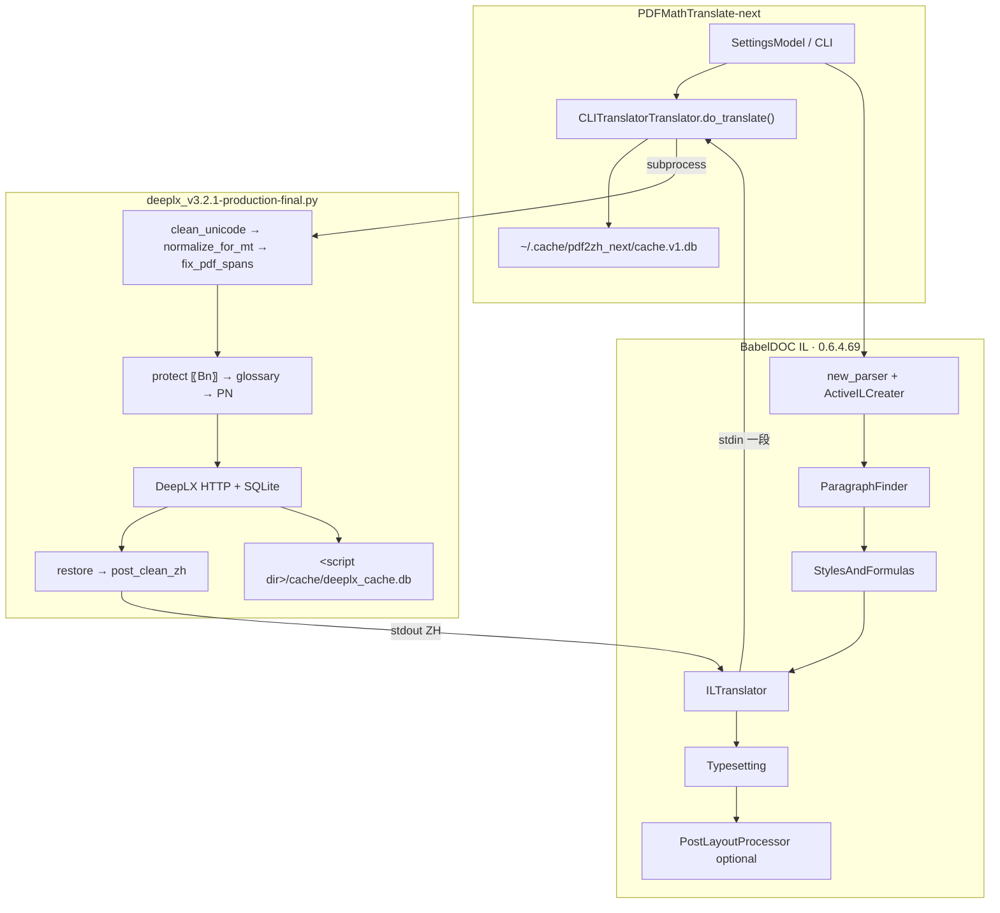
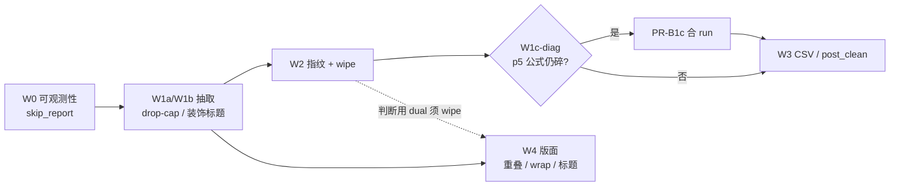
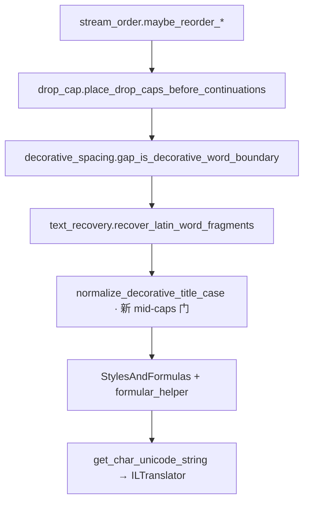
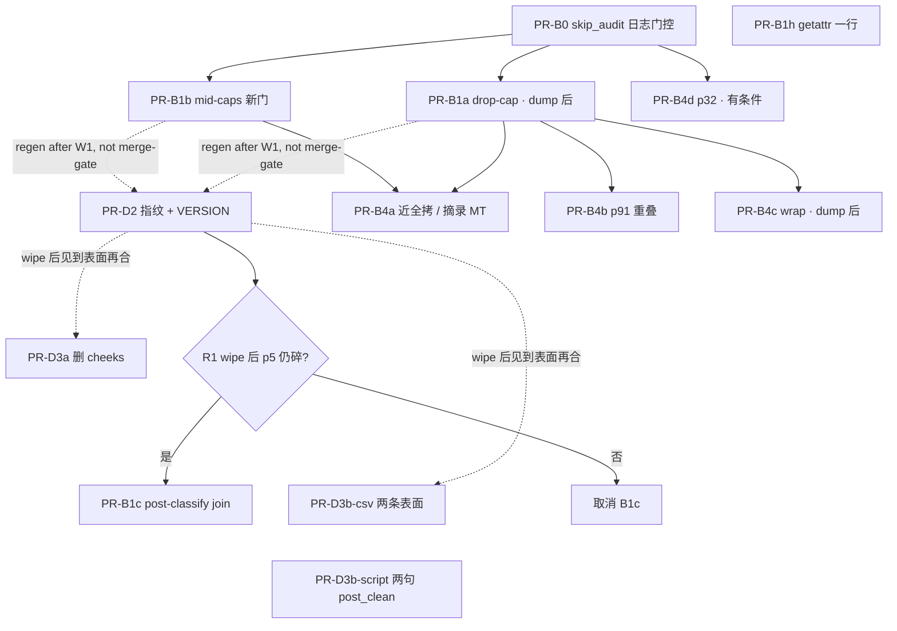

# Orgasmic Addiction 双栏质量波次（post 0.6.4.69）

| 字段 | 值 |
|------|----|
| **Document title** | OA Dual Quality Wave — post BabelDOC 0.6.4.69 |
| **Author** | solo operator（OA dual wave） |
| **Date** | 2026-08-17（rev 6；W4e + `{vN}` 公式占位已合 main） |
| **Status** | **Active** (operator queue; index: [`PLAN-INDEX.md`](PLAN-INDEX.md)) |
| **Baseline dual** | `/Users/yun/Library/CloudStorage/OneDrive-Personal/Documentos/Books/Gabrielle Moore/Orgasmic Addiction/Orgasmic Addiction.no_watermark.zh-CN.dual.pdf` |
| **Producer** | BabelDOC v0.6.4.69（tip `6486fae`） |
| **Sample** | 118 页，书页 p3–p120；CJK ≈53686，median 474，无页 &lt;80 CJK，`crush_pages=0` |
| **Score** | ~6.3/10，**不可发货**。术语已明显好于 0.6.4.67（党卫军 / 三峡大坝 / 保持收缩 / 裸 `ff` 主污染已清） |
| **Primary consumer** | PDFMathTranslate-next + DeepLX（非 LLM）双栏 PDF |
| **Operator** | 单人维护；双栏视觉质量 + 可复现 midend 优先于大重构 |
| **Doc index** | [`PLAN-INDEX.md`](PLAN-INDEX.md) |

---

## Overview

这不是绿地架构。这是 2026-08-13 14:37 对 Gabrielle Moore《Orgasmic Addiction》完整双评之后的**下一波增量工作计划**。系统仍是三层、互不统一：

```
PDFMathTranslate-next
  → BabelDOC IL（parse → paragraph → styles/formulas → ILTranslator → typesetting）
  → CLITranslatorTranslator.do_translate() stdin/stdout
  → deeplx_v3.2.1-production-final.py
       clean_unicode → normalize_extracted_en → fix_pdf_spans
       → protect 〖Bn〗 as QBS/QES → protect `{vN}` as QFORnQ
       → glossary（最长优先）→ proper nouns
       → DeepLX + SQLite cache → restore formula/style → post_clean_zh
```

0.6.4.69 的硬伤不是「分数不够」，而是一组**页级门禁**没过：医疗反义（p41「切除子宫」）、整段玩具段仍是带 `erent`/`ff` 的英文（p68，**从未进脚本**）、p5 公式被拆成 `（、）`/`di.`、体位标题未译、p91 红引文压住步骤、p32 章标题整段缺失、p33 脸部 cheeks 被词表打成臀瓣、p45 callout「刺激您的计算机」。

本波次**锁定顺序**：先 skip 可观测 → 再 BabelDOC 抽取完整性 → 再 normalizer + cache 指纹 → 再收紧 CSV / `post_clean_zh` → 最后版面。禁止把词表当抽取创可贴，禁止恢复 `font.unknown`，禁止改写 `typesetting.py` 上帝文件，禁止统一两套 `BaseTranslator` cache。

---

## Background & Motivation

### 当前代码基线（已核对树）

| 项 | 状态 |
|----|------|
| BabelDOC 版本 | `0.6.4.69`（`babeldoc/const.py`、`pyproject.toml`） |
| Tip | `6486fae`：`is_formulas_middle_char` 允许 `x`/`X` 续跑；`_looks_like_side_callout` 对称识别左页边 gutter pull-quote |
| 未提交脏工作区 | `side_callout_skip.py` **+70/−24**，全是 `logger.debug` 几何/匹配日志，**不是** skip 谓词变更 |
| 架构计划已完成 | S1、S1.1、S2、S3、L3（见 `docs/architecture-optimization-plan.md`） |
| 架构文档写的「下一步 L4」 | header skip ≠ reflow。**本波只在 p32 章标题缺失 / header 误杀的因果链上才碰 L4**，不做通用 header 语义重写 |
| OA P0 证据 vs 过期 L4 备注 | **OA 0.6.4.69 双评证据优先** |
| `font.unknown` / 可搜索双层 | **操作员冻结**（SCORECARD F1–F4）。本波不排 glue/dict/pull-back |

`6486fae` 的 x-continue **已经在树里**。deeplx **已经**在 HTTP 前跑 `protect_formula_placeholders`、之后 `restore_formula_placeholders`（`_RE_FORMULA_PLACEHOLDER` 匹配 `{vN}`，token `QFORnQ`；脚本 L780–818、L1337–1394）。`babeldoc_pipeline_review.md` §3.2 关于「脚本不保护 `{vN}`」已过期。0.6.4.69 dual 的 p5 仍是 `（、）` / `di.`——**不是**「未保护的 `{vN}` 进 DeepLX」。活着的因果按优先级：**(1) pdf2zh_next / deeplx cache 写于 x-continue 或 formula-protect 之前**；**(2) `+`/`=` 与数字不在同一 composition，算术从未合成一条 `PdfFormula`**；**(3) `di.` 是连字残骸**。若 wipe + IL dump 仍见被啃掉的 token，工作是 **QFORnQ restore 加固**（脚本已有 leak warning），不是再铺一条 protect 路径。

### 三层系统（禁止统一）



DeepLX 路径是 **duck-typed**：`CLITranslatorTranslator` 继承的是 `pdf2zh_next.translator.base_translator.BaseTranslator`，不是 `babeldoc.translator.BaseTranslator`。`do_llm_translate` 默认 `NotImplementedError` → `translator_supports_llm` 为假 → 走 `ILTranslator`。BabelDOC 自带 peewee cache（`~/.cache/babeldoc/cache.v1.db`）在这条路上**不会被用到**。

### 三套 cache（rollout 必须点名）

| Cache | 路径 | 指纹包含 | 指纹**不含** | 本波动作 |
|-------|------|----------|--------------|----------|
| deeplx | `<script dir>/cache/deeplx_cache.db` | `VERSION` + glossary 内容指纹 + PN 指纹 + **normalize 之后**的源文 | **`normalize_extracted_en.py` 文件哈希** | 扩展指纹后 **wipe** |
| pdf2zh_next | `~/.cache/pdf2zh_next/cache.v1.db` | engine=`clitranslator` + lang + command 字符串 + timeout + `--glossary`/`--proper-nouns` **文件内容 SHA-256** | sidecar `normalize_extracted_en.py`；脚本本体（除非 command 字符串变了） | **每次 dual regen 操作员 wipe**。命中则 `do_translate` 根本不启动，deeplx 指纹毫无意义 |
| babeldoc `BaseTranslator` | `~/.cache/babeldoc/cache.v1.db` | peewee engine+params | — | **本波不碰、不统一** |

`CLITranslatorTranslator.__init__` 只对 `_CACHE_FILE_FLAGS = ("--glossary", "--proper-nouns")` 做内容指纹（`pdf2zh_next/translator/translator_impl/clitranslator.py`）。改 normalizer 而不改 CSV、不 wipe pdf2zh cache → 整本 dual 仍是旧译文。

### 痛点（0.6.4.69 双评，按层分类）

**分类铁律（本计划必须保持）：**

- 英文从未以完整短语到达 → **先 BabelDOC**。
- 英文完整到达但中文错 → **glossary / deeplx**。
- 左栏仍有 `erent` / 裸 `ff` / 整段英文 = **没进脚本**。先查 `skip_report`，**禁止**给整段正文加 glossary 行。

#### P0

| # | 页 | 现象 | 分类（铁律） | 第一落点 |
|---|----|------|--------------|----------|
| 1 | p41 | 「切除子宫」；EN 已是 `somewhere ecting the uterus`（affecting 被撕） | 抽取不完整 → 医疗反义 | BabelDOC recovery + 之后 `post_clean_zh` 兜底 |
| 2 | p63 | enemas / 孤立 `water` 交叉污染灌肠安全段 | 待 skip_report；完整 EN 到了才动词表 | 先审计，再极少量表面 key |
| 3 | p68 | 整段玩具段仍是英文（`Dildos, butt plugs… erent shapes`） | **没进脚本**（残留 `erent`/`ff`） | `skip_audit`，禁止整段 glossary |
| 4 | p91 | 红 pull-quote 压住正文步骤，不可读 | 版面重叠 | typesetting 后重叠 / exclusion / post-layout |
| 5 | p45 | callout：`fiway` + 「刺激您的计算机」（applications；fi 连字 + either way） | `fiway→way` 已在 normalizer；仍出现 = 没进脚本或 cache | skip_report + wipe cache；`post_clean` 只修这一句 |

#### P1

| # | 页 | 现象 | 分类 | 第一落点 |
|---|----|------|------|----------|
| 6 | p59 / p63 | `SLoWcoMfortabLe ScreW…`、`THE FINGER-LICKING GOODS` 仍 EN | p63 标题 CSV 已有 `the finger-licking goods` → **极可能没进脚本**；p59 装饰大小写 lower 后变成 `slowcomfortable`，`_TERM_SEP_RE` 的 camelCase 切分发生在 `normalize_key` **之后**，永远切不开 | 先 skip；抽取/装饰标题规范化；再少量真实表面 key |
| 7 | p19 / **p32** | `第三章 beanactIonMan`；**p32 ZH 章标题整段缺失**（EN 有 CHAPTER 5 SEXUAL ANATOMY） | **此 dual `skip_header=True`**。header 带误杀是活假说（拆段 `CHAPTER 5` / `SEXUAL ANATOMY` &lt;24 字）。仍以 skip_report 结案 | skip_report 分诊；B4d 仅报告证实 skip 时开 |
| 8 | p100 / p117 | `aLL InacrobatIc`、`MISSIOnary` 标签 glue | 装饰标题 / 抽取 | `text_recovery` / `decorative_spacing` |
| 9 | p5 | 公式 `(3+2+2=7, 3x2x2=12)` 仍 `（、）` / `di.` | x-continue 与 `{vN}`→QFOR 保护均已落地 → **先 wipe 再 IL dump**；其次 style 切碎；`di.` 当连字残骸 | W1c-diag（D2 wipe + `--pages 3` dump）；B1c 仅 dump 仍碎时开 |
| 10 | p3 / p7 / p33 | 掉字 W/Q/T 留在正文 | 可能是独立 `PdfParagraph`，不是同一 stream 未粘合 | W1a-diag IL dump；再决定 `drop_cap` vs `paragraph_finder` 窄合并 |
| 11 | p7 / 19 / 33 / 68 / 117 | figure-wrap 撕碎 | 绕图区间 | `figure_wrap` / `wrap_shape` / `line_interval_plan`，**不**改写 typesetting 上帝文件 |

#### P2（本波不作为硬门禁）

| # | 页 | 现象 | 备注 |
|---|----|------|------|
| 12 | p33 | 脸 *cheeks* → 臀瓣 | CSV 过击：`cheeks,臀瓣` 盖住 `cheek,脸颊` |
| 13 | p5 / p41 / p120 | 七重三重；短篇小说（*The Short Story*）；心船 | P2；**本波不写 post_clean**。R2 后再对着 EN |
| 14 | — | her/ent/g-spot 残骸 | 抽取 + sanitize，不加十行变体 |
| 15 | 30+ 页 | 纵向缝 &gt;120pt | 部分是源设计；gap contract **可选** |

术语回归（必须保持 0）：党卫军、三峡大坝、保持收缩、裸 `ff`。

### 页码约定（锁定）

源 PDF 为书页 p3–p120 共 118 页。双栏是并排（中文左 / 英文右），页数仍是 118。

| 书页 | 约 PDF 1-based | 约 IL `page_number`（0-based） |
|------|----------------|--------------------------------|
| p3 | 1 | 0 |
| p5 | 3 | 2 |
| p19 | 17 | 16 |
| p32 | 30 | 29 |
| p41 | 39 | 38 |
| p45 | 43 | 42 |
| p59 | 57 | 56 |
| p63 | 61 | 60 |
| p68 | 66 | 65 |
| p91 | 89 | 88 |
| p100 | 98 | 97 |
| p117 | 115 | 114 |
| p120 | 118 | 117 |

公式：`book = pdf_1based + 2 = il + 3`。`--pages` 是 **1-based PDF 页**（`3` = 书页 p5），**不是**书页号。IL `page.page_number` 是 0-based **原始** `pageno`，`--pages` 过滤后仍保留原号。`skip_report` **必须同时用 `unicode_preview` 检索**，不要只信 `page_number`。

**操作员一张表（W0 / 门禁共用）：**

| 书页 | `--pages` | IL `page_number` | skip `unicode_preview` 针 | 左栏 grep（硬门禁） |
|------|-----------|------------------|---------------------------|---------------------|
| p3 | `1` | 0 | 孤 `W` / 段首大写 | 无独立 `W` |
| p5 | `3` | 2 | `(3+2+2` / `3x2x2` / 红条预览 | `3+2+2=7` 且 `3x2x2=12`（或数字完整） |
| p7 | `5` | 4 | 孤 `Q` / wrap 窄条 | 无独立 `Q` |
| p9 | `7` | 6 | 左栏 callout / 窄条 | （对照，非硬门禁） |
| p19 | `17` | 16 | `beanactIonMan` / `Be an Action` | 无 `beanactIonMan` |
| p32 | `30` | 29 | `CHAPTER 5` / `SEXUAL ANATOMY` / `ANATOMY` | ZH 可见章标题 |
| p33 | `31` | 30 | 孤 `T` / `cheeks` | `脸颊` 且无孤 `T` |
| p41 | `39` | 38 | `ecting the uterus` / `uterus` | 无 `切除子宫` |
| p45 | `43` | 42 | `fiway` / `applications` / `either way` | 无 `刺激您的计算机` |
| p59 | `57` | 56 | `SLoW` / `coMfortabLe` / `ScreW` | 无整段 `SLoWcoMfortabLe` |
| p63 | `61` | 60 | `FINGER-LICKING` / `enema` / `water` | 无整段 `THE FINGER-LICKING GOODS` |
| p68 | `66` | 65 | `Dildos` / `butt plugs` / `erent` | 无 `erent` 整段 EN |
| p91 | `89` | 88 | 红条 / pull-quote 预览 | 目视无叠字（**全本 dual**） |
| p100 | `98` | 97 | `aLL InacrobatIc` | （P1 glue） |
| p117 | `115` | 114 | `MISSIOnary` | （P1 glue） |
| p120 | `118` | 117 | `心船` 对应 EN | P2，不挡 ship |

W0 子集命令（1-based PDF；**不要**把书页号传给 `--pages`）：

```bash
pdf2zh_next --pages 1,3,5,7,17,30,31,39,43,57,61,66,89 --debug \
  …  # 其余参数与 0.6.4.69 dual 相同
# 然后复制：
#   ~/.cache/babeldoc/working/<stem>/skip_report.json
```

`--pages` 子集对 **skip_report 有效**（谓词按页；`page_number` 仍是原号）。对 W4 目视验收**偏弱**（文档级 `first_paragraph` / `recent_title_paragraph`）。**p91 / p32 目视签字只认 118 页全本 dual。** 中间门禁（skip 归因、公式数字、左栏 grep）可用上表子集。

---

## Goals & Non-Goals

### Goals

1. 下一份 dual **按页硬门禁**验收，不接受「总分 8/10」代替门禁。
2. 先证明「谁 skip 了这段」，再改谓词。
3. 让完整英文表面到达 DeepLX（drop-cap / 连字 / 公式 run / 装饰标题），词表才能命中已有 key。
4. 让 deeplx cache 指纹包含 `normalize_extracted_en.py` 哈希；regen 时同时 wipe deeplx **和** pdf2zh_next cache。
5. 收紧 `cheeks` 过击；用**少量**真实表面 key + `post_clean_zh` 只修已锁定的「切除子宫」「刺激您的计算机」。**禁止**每个体位名堆 10 条引号变体。七重三重 / 心船是 P2，对着 wipe 后 dual 的 EN 表面再另开 commit。
6. 修 p91 重叠、p5 pull-quote（近全拷 host ZH+composition，摘录一次 MT）、figure-wrap 撕碎、p32 可见章标题。
7. 单关注点 PR（`AGENTS.md`）：设计文档、glossary、排版不得混在一次 commit。

### Non-Goals

| 不做 | 原因 |
|------|------|
| 恢复 `font.unknown` / 可搜索双层（F1–F4 glue/dict/pull-back） | SCORECARD 操作员冻结 |
| 重写 `typesetting.py` 上帝文件 / 机械拆包 | T1 是架构 backlog，不是本波因果链 |
| 统一 BabelDOC 与 pdf2zh_next 两套 `BaseTranslator` cache | 正交、高风险、零 dual ROI |
| 通用 L4 header 语义重写 | 只在 p32 被 skip_report 证伪为 header 误杀时做**窄修复** |
| 把 pattern/composer 路径接到 production | 仍是实验路径 |
| 给整段未进脚本的正文加 glossary | 违反分类铁律 |
| 把分数当作验收 | 页级门禁 |
| 改 PDFMathTranslate-next 产品形态 | 最多可选：CLITranslator 给脚本文件加指纹；默认仍是操作员 wipe |

### 与架构 MVP 的关系

`docs/architecture-optimization-plan.md` 的 S1–S3 / L3 已完成。该文档写「next L4」。**本波按 OA P0 证据排期**，不把 L4 当成下一件必做的架构仪式。绕图质量继续走已落地的 `LineIntervalPlan` / `get_intervals_at`（S3），只修 OA 撕碎页，不重开 multi-interval 设计。

---

## Proposed Design

### 波次顺序（禁止颠倒）



W3 的 glossary 行**假定** W1a/W1b 已送出完整 key。W4 的绕图/标题几何**假定 W1 段落已恢复**，**不**等 D3 CSV/`post_clean`。禁止为了「先看到中文」把 W3 提前。

**公式是波次序的唯一例外：** `6486fae` 已落地 x-continue，B1c 在不知道 0.6.4.69 p5 只是旧 cache 之前不要改 `styles_and_formulas.py`。W1c-diag = D2 wipe + `--debug` IL dump（`--pages 3`）。仅 dump 仍碎才开 B1c。

### W0 — 可观测性（改谓词之前）

**目标：** 在改任何 skip 真值之前，拿到 OA 目标页的 `skip_report.json`。

`ILTranslator._maybe_write_skip_report`（`il_translator.py` L565–581）在 `debug` **或** `working_dir is not None` 时写 `skip_report.json`。`TranslationConfig` **总会**设 `working_dir`：

- `debug=True` → `~/.cache/babeldoc/working/<stem>/`，`_is_temp_dir=False`，**保留**
- `debug=False` → `tempfile.mkdtemp()`，`finally` 里 `cleanup_temp_files()` **删掉**

因此操作员必须用 **`--debug`**（或显式传入持久 `working_dir`）。否则报告写了即删。

**操作步骤（W0，无行为变更）：**

1. 处理未提交的 `side_callout_skip.py`（见下，独立 PR）。
2. **操作员事实：0.6.4.69 dual 是 `skip_header=True` 生成的**（不是 PMT 默认 False）。`header_height` 未另报，按默认 **40pt** 除非操作员改过。W0 报告仍要搜 p32。
3. 用当前 tip + `--debug` + 上表 `--pages 1,3,5,7,17,30,31,39,43,57,61,66,89` 跑 OA。**`--pages` 填 PDF 号，不要填书页号。**
4. 复制 `~/.cache/babeldoc/working/<stem>/skip_report.json`。
5. 按 `unicode_preview` 检索（含 **p5** 公式与红条——B4a 依赖报告里的 `pullquote`）。

**已落地的 `SkipReason` 稳定字符串**（`skip_audit.py`，勿改名）：

`figure_text` · `header` · `footer` · `url_chrome` · `page_number` · `ultra_narrow` · `pullquote` · `pure_numeric` · `placeholder_only` · `too_short` · `vertical` · `empty_composition`

调用链（已核对 `il_translator.py`，禁止在 W0 改真值）。**加 skip_audit 字段必须落在真正 `record_skip` 的函数里**：

```
ILTranslator.translate()
  └─ process_page  (L680+)
       ├─ region_skip_reason → record_skip 后 **continue，不 submit**
       │    ├─ should_skip_figure_text_paragraph → figure_text
       │    └─ classify_header_footer_skip → header | footer | url_chrome | page_number
       └─ executor.submit(translate_paragraph)
            ├─ should_skip_side_callout_mt → pullquote | ultra_narrow   (L1840)
            ├─ pre_translate_paragraph
            │    ├─ VERTICAL
            │    └─ get_translate_input
            │         ├─ EMPTY_COMPOSITION / PURE_NUMERIC / PLACEHOLDER_ONLY
            │         └─ 返回后 TOO_SHORT（min_text_length）
            └─ 连续重复句 → 误记为 SkipReason.PULLQUOTE（已知标签污染，本波不改枚举）
```

`should_skip_header_footer` 委托 `region_skip.classify_header_footer_skip`。`title` / `section_header` 经 `HEADER_EXEMPT_LABELS` 永不跳过。长 `plain text`（≥ `HEADER_BODY_MIN_CHARS=48`，或高块 ≥ `HEADER_BODY_MIN_CHARS_TALL=24` 且高 ≥ `HEADER_BODY_MIN_HEIGHT_PT=28`）在 header 带内仍 MT（PR-C2）。

**p32 先验（Q5 已结）：** 此 dual **`skip_header=True`**，header 带 skip 是**活假说**。整串 `CHAPTER 5 SEXUAL ANATOMY` 是 **24** 字符，等于 `HEADER_BODY_MIN_CHARS_TALL`；若仍是一段且高 ≥28pt，tall 豁免仍会放行。更可能进窗口的是**拆段**（`CHAPTER 5`=9、`SEXUAL ANATOMY`=14）。两仓代码默认仍是 `False` / `40pt`——只是这次 regen 开了开关。分诊树见 W4 p32。仍以 skip_report 结案，不要在报告前改谓词。

#### 未提交脏 diff（必须处理，禁止带进 production）

`git diff` 对 `side_callout_skip.py` 是 +70/−24，全部是 `_looks_like_side_callout` / `is_pullquote_duplicate_of_body` 的 `logger.debug`（`id`、`branch`、`left_ratio`、`quote_preview`）。谓词几何（左 gutter `right_ratio > _PULLQUOTE_LEFT_RATIO`）已在 `6486fae` 提交。

**锁定：** 丢掉 ad-hoc logger，**或**收成 debug 门控的 skip_audit 附加字段。禁止生产路径无门控刷日志。

推荐：`SkipEvent` 是 **frozen dataclass**（`skip_audit.py` L43–50），`record()` 不能临时挂 `left_ratio`。加法：`debug_extra: dict | None = None`（或若干可选 float）。仅当 `translation_config.debug` 时填充。`schema_version` 仍为 1。更新 `test_skip_audit.py`。**禁止**在热路径上即使 DEBUG 也打无界 `text=%r`（脏 diff 每个 callout 检查打 50–60 字——删掉，preview 只进 `SkipEvent.unicode_preview`）。

### W1 — BabelDOC 抽取完整性

没有完整英文表面，W3 的 glossary 是盲打。



#### W1a — drop-cap（p3 / p7 / p33 孤 W/Q/T）

文件：`babeldoc/format/pdf/document_il/utils/drop_cap.py`  
测试：`tests/test_drop_cap.py`

已有：`is_drop_cap_pair`（字号比 ≥ `DROP_CAP_SIZE_RATIO=1.35`）、`rejoin_drop_cap_in_text`（只粘「大写 + 单个小写」，`A man` 不粘）、`place_drop_caps_before_continuations`（流序自下而上时把大写挪到词剩余之前）。

历史 `docs/p1_ink_gap_accept_oa_dual_layout.json` 在章首页记过单独的 `"y"`（Anatomy 的尾巴）和 `"W"` / `"L"`。现有 `place_drop_caps_before_continuations` 已能在**同一字符流**里配对 Trajan 大写 + 邻近小写（`test_geometry_if_you_want`）。0.6.4.69 左栏孤 W/Q/T **也可能是独立 `PdfParagraph`**——`get_char_unicode_string` 无法跨段合并。

**W1a-diag（改代码前）：** `--debug` IL dump，PDF `--pages 1,5,31`（书页 p3/p7/p33）。看孤字母是同一 `pdf_paragraph` 里的未粘合字符，还是自己的 `PdfParagraph`。

**然后按 dump 分支（禁止猜）：**

| dump | 改哪里 | 不改什么 |
|------|--------|----------|
| 同段未粘合 | 扩 `drop_cap.py` 配对（右邻、近基线）。已有测试继续绿 | 不写 `typesetting.py` |
| **独立段** | `paragraph_finder` **窄合并**：字号比 ≥ `DROP_CAP_SIZE_RATIO` + 右邻 + 同基线，把单字母段并进后续词段。PR 文件须含 `paragraph_finder.py` + 新单测 | 不做中文 drop-cap 几何 |
| 流内已粘合但仍画出大写 | 粘合后抑制独立 composition（`drop_cap` 标记已吸收，或 finder 不再为单字母 drop-cap 建段）。**钩子在 drop_cap / finder，不是重写 typesetting** | 禁止改 `typesetting.py` 排版循环 |

验收：p3/p7/p33 正文不再出现单独的 W/Q/T。

#### W1b — 装饰间距 / 标题恢复（p19 / p59 / p100 / p117）

文件：

- `babeldoc/format/pdf/document_il/utils/decorative_spacing.py` — `is_decorative_text`、`gap_is_decorative_word_boundary`
- `babeldoc/format/pdf/document_il/utils/text_recovery.py` — `has_decorative_mid_caps`、`normalize_decorative_title_case`、`space_chapter_number`、`recover_latin_word_fragments`
- `babeldoc/format/pdf/document_il/utils/stream_order.py` — `maybe_reorder_reversed_stream`（title / section_header / 过几何门的 plain）
- `babeldoc/format/pdf/document_il/midend/paragraph_finder.py` — 章号与标题**保持分段**（红 Trajan / 黑 display 各译）；`merge_stacked_narrow_callout_paragraphs`

`normalize_decorative_title_case` 已存在：长度 ≤80、以 ASCII 字母为主、`has_decorative_mid_caps` → **整段 lower**。今天**唯一**调用点是 `layout_helper.get_char_unicode_string` L499–500，且包在 `is_decorative_text` 里。该谓词要求 ≥70% 单字母 **且** ≥50% 间隙 > 2× 平均字宽（字距），外加字号/基线门（`decorative_spacing.py` L13–69）。p59 `SLoWcoMfortabLe ScreW` 是 **mid-caps**（`has_decorative_mid_caps`），字母往往已经贴在一起 → `is_decorative_text` 为假 → lower **从不跑**。`update_paragraph_data` 已经走 `get_char_unicode_string`；在同一扇门后再调一次是空操作。

**本波新门（W1b 的实际改动）：**

`has_decorative_mid_caps` 对 `[a-z][A-Z]` 为真（`text_recovery.py` L584），因此 `iPhone` / `eBay` / `anSWer` 都会命中。`normalize_decorative_title_case("iPhone and eBay")` 会变成 `"iphone and ebay"`。**禁止**用「短 + mid-caps + ASCII」单独开 OR——那会 lower 任何带品牌的 12pt 正文，并与 `test_pr_a_word_fragment_recovery.py` L159–171 冲突。

```
should_normalize_midcap_title(para) :=
    has_decorative_mid_caps(unicode)
    and len(unicode) <= 80
    and 以 ASCII 字母为主          # 与 normalize_decorative_title_case 相同
    and (
        layout_label in {"title", "section_header"}
        or is_display_title(para)  # vertical_gap.py：max_font ≥ DISPLAY_TITLE_SIZE_PT=28
                                   # 或 title 标签且 size ≥ 18
    )
```

`layout_label in {title, section_header}` **单独**不够当充分条件：无 mid-caps 时 `normalize_decorative_title_case` 本就会 no-op，所以 mid-caps 必须 AND。  
**不要**对 `BODY_LAYOUT_LABELS`（`plain text` / `text` / …）在正文字号上开 OR。p59 若是大号 display，走 `is_display_title`；若 R1 dump 证明 p59 是 12pt `plain text`，**不要**把门降到正文字号——另开 dump 门控的 label 提升 PR，而不是 lower 全短 mid-caps 串。

**调用点（指定一处）：** `ParagraphFinder.update_paragraph_data(..., update_unicode=True)` 在 `get_char_unicode_string` **之后**。ILTranslator 预 MT 不要重复。

**单测（两条都要）：**

1. display 标题（`layout_label=title` 或 font ≥28）`SLoWcoMfortabLe ScreW`、**无大字距** → `slowcomfortable screw`。
2. `layout_label="plain text"`、12pt、`The iPhone works today.` → **保持** `iPhone`（不得变成 `iphone`）。

p19 `第三章 beanactIonMan`：`space_chapter_number` + `fix_untranslated_chapter_markers`（`ILTranslator`，`Chapter N` → `第N章`，`e2a17a3`）已处理章号；`beanactIonMan` 走新 mid-caps 门（`be an action man` 已在 CSV）。

p59 `SLoWcoMfortabLe ScreW`：新门 lower → `slowcomfortable screw`。CSV key 是 `slow comfortable screw`（slow 与 comfortable 之间有空格）。**只 lower 不够。** 本波 **不加** 10 条引号变体；只加**一条**真实表面 key `slowcomfortable screw`（W3，且须在 wipe 小样里先见到该表面）。禁止在已 lower 的串上跑 `_TERM_SEP_RE` 的 `(?<=[a-z])(?=[A-Z])`——对 `SLoWcoMfortabLe` 会切成 `S Lo W co Mfortab Le`。

p63 `THE FINGER-LICKING GOODS`：CSV 已有 `the finger-licking goods`。若仍整段 EN → **没进脚本**，不是缺行。

p100 `aLL InacrobatIc`、p117 `MISSIOnary`：同一装饰标题路径。

#### W1c — 公式 run（p5 `(3+2+2=7, 3x2x2=12)`）

文件：

- `babeldoc/format/pdf/document_il/utils/formular_helper.py` — `is_formulas_start_char`、`is_formulas_middle_char`
- `babeldoc/format/pdf/document_il/midend/styles_and_formulas.py` — `_classify` 循环（约 L420–550）：`in_formula_state`；数字可被 `prose_numbers.is_prose_number_run` 降级
- `babeldoc/format/pdf/document_il/utils/prose_numbers.py`
- 测试：`tests/test_prose_number_formula.py`

已落地（`6486fae`）：`is_formulas_middle_char` 在**已打开**的公式 run 里把 `x`/`X` 当续写。`+`/`=` 是 Unicode `Sm`，`is_formulas_start_char` 已视为公式字符；数字是 start。deeplx **已经** `protect_formula_placeholders` / `restore_formula_placeholders`（`{vN}` → `QFORnQ`）。`_classify_characters_in_composition`（`styles_and_formulas.py` ~L412–550）是 **per composition**；`in_formula_state` **不跨** style/font run。

**活着的因果（按序）：**

1. **Cache** 写于 x-continue **或** formula-protect 之前。
2. `+`/`=` 与数字已是不同 composition，分类前算术已碎。
3. `di.` 是连字残骸，不是公式。

`{vN}` 未保护 **不是** 活因果。若 dump 仍见被啃 token：加固 `restore_formula_placeholders`（已有 QFORnQ leak warning），不要再铺 protect。

**W1c-diag（先于任何 B1c 代码）：** D2 wipe 两套 cache + `--debug` + `--pages 3`（书页 p5）。看 `create_il.debug.json` / styles 后快照。若公式数字已在 dual 左栏 → **取消 B1c**。

**仅当 dump 显示同一段内多条仅被 `Sm`（`+`,`=`）/`x`/`X`/数字/`,` 隔开的 `PdfFormula` 时才开 B1c。算法（指定，不是「别在边界切断」）：**

- **不要**改 `is_formulas_start_char` 让 `x` 开跑（`6486fae` 只允许 middle 续写）。
- 在 composition 分类**之后**做 join：相邻公式 composition 之间若只夹着 `+` `=` `x` `X` 数字 `,` 的公式/符号碎片，合并为一条 `PdfFormula`。
- 文件：`styles_and_formulas.py`（post-classify join）。`formular_helper.py` 仅当 join 需要共享谓词时才动。
- 保持 `is_prose_number_run` 降级（`3D` / `50 Shades` / `20 feet` 不得被 join 吃进公式）。
- 金句单测 `(3+2+2=7, 3x2x2=12)` **只在 dump 证实碎裂后**再加。

### W2 — `normalize_extracted_en` + cache 指纹

文件（**不在 BabelDOC 仓**）：

- `/Users/yun/Nextcloud/docker/docker-compose/PDFMathTranslate/deeplx/deeplx_v3.2.1-production-final.py`
- `/Users/yun/Nextcloud/docker/docker-compose/PDFMathTranslate/deeplx/normalize_extracted_en.py`（必须与脚本同目录；缺失则内置 minimal，stderr 会警告）

加载：`_load_normalize_for_mt()`（脚本 L65–133）按路径加载 `normalize_for_mt` 或 `normalize_extracted_en`。sidecar 的 `normalize_for_mt` 是 `normalize_extracted_en(..., aggressive_ff_strip=True)` 的别名。

sidecar **已经**包含 `fiway→way`、`erent→different`、`fferent→different`、裸 `ff` 剥离。p45/p68 仍见这些碎片 = 文本没进脚本，或 cache 绕过了脚本。

**必须做的指纹变更**（`TranslationCache.make_key` / 模块级 `VERSION`）：

```python
# 现状（deeplx L1120–1122）
raw = f"{VERSION}|{gl_fp}|{pn_fp}|{text}"

# 目标
norm_fp = sha256(normalize_extracted_en.py contents)[:16]  # 文件缺失 → "builtin-minimal"
raw = f"{VERSION}|{gl_fp}|{pn_fp}|{norm_fp}|{text}"
```

同时把 `VERSION` 从 `3.2.1-production-final+norm_en_cache_v4` bump 到 `..._v5`，旧行全部 miss。

**然后 wipe：**

```bash
rm -f /Users/yun/Nextcloud/docker/docker-compose/PDFMathTranslate/deeplx/cache/deeplx_cache.db
rm -f ~/.cache/pdf2zh_next/cache.v1.db
# babeldoc cache.v1.db 本波不删（DeepLX 路径不用它）
```

pdf2zh_next cache 不含 sidecar 哈希。本波**默认操作员 wipe**，不改 PDFMathTranslate-next。可选后续（非本波门禁）：`CLITranslatorTranslator` 对脚本路径做与 glossary 相同的内容指纹。

`{vN}` passthrough **已经上船**（`protect_formula_placeholders` / `restore_formula_placeholders`）。W2 **不要**再加一条 protect。若 wipe 后仍见 QFORnQ 泄漏：只加固 restore 的宽容匹配（脚本 L1386–1394 已 warn）。**不要**在 W2 改 glossary 匹配器去「修复」装饰驼峰——那是 W1b + 一条表面 key。

`mt_token_sanitize._FORMULA_V_TOKEN_RE`（L131）在公式对象还原之后从 **paragraph unicode** 删掉残留 `{vN}`——这是正确的文本层契约。**不要**开始在 unicode 里保留 `{vN}`。

### W3 — CSV 收紧 + 少量 `post_clean_zh`

文件：

- `/Users/yun/Nextcloud/docker/docker-compose/PDFMathTranslate/glossaries/sextips_v3.1_cleaned.csv`
- `deeplx_v3.2.1-production-final.py`：`apply_glossary_mask` + `ContextGuard` + `EXACT_MATCH_ONLY`；`post_clean_zh` + `_ZH_POST_REPAIRS`（约 L974–1062）

已有、不要再堆引号变体：`party hard`、`twisted girl`、`nectar of three flowers`、`trip down under`、`finger-licking goods`、`slow comfortable screw`、`be an action man`、`man with a plan`。2026-08-11 OA 批次已在 CSV 底部。

#### cheeks 过击（p33）

| 行 | 现状 | 本波 |
|----|------|------|
| `cheeks,臀瓣` | 无语境，打到脸 | **删**或改为必须有 butt/ass 语境（删除更干净：最长优先已覆盖多词） |
| `cheek,脸颊` | 被上面一行挡住 | 保留 |
| `her cheeks,她的臀瓣` | 身体语境 | 保留 |
| `butt cheeks` / `ass cheek` / `between her cheeks` | 身体语境 | 保留 |

`apply_glossary_mask` 按 `len(src)` 降序。删掉无语境的 `cheeks` 后，脸上的 `cheeks` 走 `cheek`+形态 → 脸颊。

#### 允许的新表面 key（少）

| 源表面 | 译 | 为何算「真实表面」而不是变体堆 |
|--------|----|--------------------------------|
| `slowcomfortable screw` | 慢速舒爽上墙式 | W1b lower 后的实际 MT 串 |
| `affecting the uterus` | 影响子宫 | 抽取修复后的医疗短语 |

**不要**加 `"the slow comfortable screw"` 的十种引号/大小写变体。`THE FINGER-LICKING GOODS` 已能 casefold 命中。

#### `_ZH_POST_REPAIRS` 本波只追加已锁定的两句

| bad | good | 页 |
|-----|------|----|
| `切除子宫` | `影响子宫` | p41（子宫切除术 ≠ affecting the uterus） |
| `刺激您的计算机` | `刺激您的应用` | p45 |

`七重三重` / `心船` / `短篇小说` 是 **P2**，**不进本波 D3b**。对着 wipe 后 dual 的真实 EN 表面再另开 commit，禁止现在猜译。

`ContextGuard` / `EXACT_MATCH_ONLY` 不要为了 cheeks 或 uterus 去改——那是 `hard`/`come`/`cream` 的歧义通道。

### W4 — 版面（抽取与译文稳定之后）

**禁止**重写 `typesetting.py`。只走现有钩子：`exclusion_zone`、`figure_wrap`、`wrap_shape`、`line_interval_plan`、`layout_gap_hooks`、`post_layout_processor`、`callout_merge`。

#### p91 红引文压步骤（硬门禁）

现有机制：

- `QuoteZoneConfig` 已打进主 typesetting（S2，`exclusion_zone.py`）
- `Typesetting.fix_overlapping_paragraphs_post_typesetting`（约 L2881）：保留 `render_order` 更早的段，收缩后来者高度并按已有 `optimal_scale` 重排
- `PostLayoutProcessor.OverlapDetector` / `QuoteDetector`（`enable_post_layout_optimization`，PMT 默认 **False**）
- pull-quote 近副本始终 skip MT（`should_skip_side_callout_mt`），与 `narrow_callout_mode` 无关

**锁定修复顺序：**

1. 确认红条被 `QuoteZoneConfig` / `layout_intent=PULL_QUOTE` 收成 exclusion zone，且 **不是** `WRAP_COLUMN`（`_para_is_quote_for_zone` 已排除 figure-wrap）。
2. 若 zone 在但 CJK 行距仍画进 zone：收紧该页 quote 边距，或让 post-typeset overlap 收缩**正文**而不是红条（红条 `render_order` 通常更早——今天的「保留先画」可能是错的一方）。需要的话为 PULL_QUOTE 做「保留 quote、重排 body」的优先级，**局部函数 + 测试**，不要重构整个 overlap 循环。
3. 不要为本缺陷默认打开全局 `enable_post_layout_optimization`。

#### p5 pull-quote：近全副本拷 ZH；摘录走一次 MT（锁定）

`6486fae` 让左 gutter 能被 `is_pullquote_duplicate_of_body` 认出来。谓词要求 host **严格更长**且 `quote in host`（`side_callout_skip.py` L176–196，`min_quote_chars=40`）——quote **永远是摘录**，不是整段。`quote.unicode = host.unicode` 会把整段正文塞进窄红条，比留 EN 更糟，也不是「复用这句引文的译文」。

另外 `Typesetting.create_typesetting_units`（L4297–4333）读的是 **compositions**，不是 `paragraph.unicode`。skip 留下原来的 `pdf_line` 英文字形，`can_passthrough`。只写 unicode 是视觉空操作。`post_translate_paragraph`（L1592–1598）两条都写：`unicode` + `parse_translate_output` → `PdfSameStyleUnicodeCharacters`。

**分案（禁止一律拷 host）：**

| 案 | 判定（skip 当时、EN 上算） | 动作 |
|----|---------------------------|------|
| **近全副本** | `len(norm_quote) / len(norm_host) ≥ 0.85`，或去引号/空白后 `norm_quote == norm_host` | skip DeepLX；join 后把 **host ZH** 写入 quote，并**替换 compositions** |
| **摘录**（p5 红条的典型形态） | 其余 `quote in host` | **不要**拷 host。**不要** skip。走正常 `translate_paragraph` → DeepLX **只译 quote 串一次** → `post_translate_paragraph` 写 unicode + compositions。6486fae 里「独立译被截断」优先当 EN composition 仍 passthrough / 窄 box 溢出，不是再拷整段 host |

找不到 host → 留 EN。`--narrow-callout-mode keep_en` 仍只管超窄条；近全副本 / 摘录分案与 mode 无关。

**可实现规格：**

1. `find_pullquote_host(paragraph, page) -> PdfParagraph | None`（从现有谓词抽出 host）。
2. `is_near_full_pullquote(quote, host) -> bool`（上表 0.85 / 去引号相等）。
3. `translate_paragraph`：**仅近全**才 `should_skip` + `record_skip(PULLQUOTE)`。摘录不 return，落入普通 MT。
4. 近全 skip 时 stash（**`id(paragraph)` 与 `id(host)` 为主键**，`debug_id` 只作报告；`debug_id` 可为 None）：
   `{quote_obj_id: {host_obj_id, quote_debug_id, host_debug_id, kind: "near_full"}}`。
5. `ILTranslator.translate()` 在 `with PriorityThreadPoolExecutor` **退出之后**、写 tracking / skip_report **之前**，只处理 `kind=near_full`：
   - host.unicode 须含 CJK，否则留 EN。
   - 调用 `_apply_zh_to_quote(quote, host.unicode)`（与 `parse_translate_output` 无占位分支 L1350–1356 同构）：
     ```
     ssu = PdfSameStyleUnicodeCharacters(
         pdf_style=quote.pdf_style,  # 用 quote 自己的 style，不是 host
         unicode=zh,
     )
     quote.unicode = zh
     quote.pdf_paragraph_composition = [
         PdfParagraphComposition(pdf_same_style_unicode_characters=ssu)
     ]
     ```
   - 排版用 quote 自己的窄 box 重流。不要复制 host 的 composition/glyph。
6. **单测必须用子串 host**（例如 host = quote + 额外一句），使 `quote.unicode == host.unicode` **失败**。断言 `pdf_same_style_unicode_characters.unicode` 含 CJK，且**短于** host ZH。另测摘录路径：`should_skip_side_callout_mt` 为假（或 translate 被调用）。禁止对译后 unicode 再跑 `is_pullquote_duplicate_of_body`。

`DEFAULT_NARROW_CALLOUT_MODE` 已是 `"expand"`（`side_callout_skip.py` L40；`TranslationConfig` L231）。`ILTranslator.translate_paragraph` 里 `getattr(..., "keep_en")` 的回退和注释过期——有 `TranslationConfig` 时走 `"expand"`。getattr 对齐是 **PR-B1h**，一行 commit，**不要**和 B0 或 B4a 绑在一起。

SCORECARD 仍写 keep_en 为默认（与代码矛盾）。本波不改 SCORECARD 正文，除非操作员要求；B1h 的 PR 描述加一句脚注指向本 K14，避免下一读者再被 SCORECARD 带偏。

#### W4e — CJK 正文满栏（**2026-08-17 已实现**，分支 `execute-plan/a58fd0cd-pr-w4e-cjk-full-measure`）

操作员 2026-08-13 在 p5「You can learn the new skills…」段拍板：**不要退回逐行对英文**，中文按整段重排，中间行撑满右缘，顶对齐英文段框。

**证据（W1+B4a+B1e dual，`tmp/oa_w1_deeplx/…dual.pdf` 右栏 p5）：**

| | 英文 | 中文现在 |
|---|------|----------|
| 行数 | 4（前 3 满栏 ~471pt，末行 84pt） | 3 |
| 行宽 | 471 / 471 / 471 / 84 | **396 / 420 / 180** |
| 顶 | y≈325 | y≈322（已齐） |
| 难看处 | — | 中间行右边空 50–70pt；断在「一次只学 / 一种」；段下因少一行空一截 |

`_uniform_cjk_reference_widths`（不复读英文短末行）方向对，但这笔没吃满栏。

**做：**

1. 中间行撑到满栏（两端对齐或 DP 填满，目标 ≥ 栏宽 ~95%）。末行左齐、允许短。
2. 断点优先 `，。；` 后。禁止「只学 / 一种」这类半截短语。落点：`line_break_optimizer` 填满权重 + `merge_cjk_units` / kinsoku 粘字，**不要**重写 `typesetting.py` 上帝循环。
3. 金样：本段 EN 4 行 / ZH 3 行可接受。不要为填英文高度加字距或硬拆成 4 行。
4. 下一段仍按英文 y 起排（双栏齐头）。先撑满行，段下洞会小；本 PR 不收缝。

**不做：**

| 不做 | 原因 |
|------|------|
| 逐行对译 / 复读英文每行宽 | 一行英文 → 半行中文，右边洞更大（旧病） |
| 拉字距凑 4 行 | 中文正文字距难看 |
| 改 `typesetting.py` 主循环 | 本波禁令；W4 只动钩子 |
| 把「混合起来新体位」当排版 bug | 译文缺「这些/的/。」，属 DeepLX/W3，不进本 PR |

**验收（p5 此段 + 同页相邻满栏段）：** 中间行宽 ≈ 英文满栏；末行可短；无「只学 / 一种」；顶仍与英文齐；`crush_pages` 不回退。

**2026-08-17 落地：** `line_break_optimizer` 末行剩余不再计费；以 `，。；` 收尾且距栏宽 ≤ slack 的中间行视为已满；词表加「技巧」。p5 dual 针段现为 456/456/84（97%），「一种。」完整，「技巧」在第二行首。未改 `typesetting.py` 主循环。

#### figure-wrap 撕碎（p7 / 19 / 33 / 68 / 117）

文件：`figure_wrap.py`（`is_figure_wrap_taper` / `is_figure_wrap_paragraph`）、`wrap_shape.py`、`line_interval_plan.py`（`LayoutAttempt`、`resolve_line_interval_plan`）。  
检测与 pin 已在 0.6.4.61–0.6.4.66 落地（CJK wrap → full-width fallback、`LEFT_FIXED`、`FULL_MEASURE`）。

`is_figure_wrap_paragraph` **已经**在嘈杂 `per_line_widths`（注释里的 `[52,100,63]`）上落到信号 2：左缘台阶 ≥12pt / 右缘钉住 ≤4pt（`figure_wrap.py` L54–81）。B4c **不是**「再实现一次检测」。

**B4c-diag（改代码前）：** 对 p7/19/33/68/117 dump `reference_metrics.per_line_widths` + line boxes。

| dump | 工作 |
|------|------|
| 信号 2 未触发，且 widths/box 显示应是 wrap | 修检测谓词（须写出失败的金宽度） |
| 信号 2 **已**触发，仍撕碎 | bug 在**区间应用**，不在检测。点名：`Typesetting._active_wrap` → `wrap_shape.get_active_wrap` / `line_interval_plan.wrap_interval`（或 legacy `typeset_wrap_line`）是否真正驱动 `_layout_typesetting_units`。对照 `Typesetting._query_line_intervals`（zone 残差）是否盖掉 pin 口袋 |

不重开 multi-interval 设计。不默认改 `typesetting.py` 上帝循环——若必须接线，只动 `_active_wrap` / 调用点小块。

#### p32 缺失章标题（条件 L4）

**分诊树（按序；此 dual 已开 header skip）：**

1. **已记录：** 0.6.4.69 dual `skip_header=True`。`header_height` 未知，按默认 **40pt** 除非操作员改过。代码默认仍是 False——不要用默认值否定这次 regen。
2. 在 skip_report 搜 `CHAPTER` / `ANATOMY` / `header` / `figure_text` / `too_short`。
3. 拆段碎片（`CHAPTER 5`=9、`SEXUAL ANATOMY`=14）比「整段 24 字大标题」更可能进 header 窗口。整段仍在且高 ≥28pt → tall 豁免仍适用。
4. 报告显示章标题碎片被 **`header` skip** → **B4d 开做**（窄豁免：`CHAPTER`+数字+标题 / ALLCAPS 短 display）。`figure_text` / `too_short` 同样算 skip 事件，仍走 B4d 窄修。**这就是本波允许的全部 L4。** 不把 translate-skip 接到 reflow exclusion。
5. 报告无事件 → **取消 B4d**。查裁切 / `enforce_title_body_gaps` / overlap / drop-cap 孤 `y`。
6. `e2a17a3` 已删 running-header skip。p32 是整段不见，不是 `Chapter5性解剖学` 半译——不要改章号正则除非报告指向它。

p32 / p91 **目视签字只认全本 118 页 dual**（子集 `--pages` 缺文档级 title 上下文）。

#### 可选 gap contract（非门禁）

`gap_contract_pass.apply_gap_contract_first_pass`、`layout_gap_hooks`、`vertical_gap.enforce_title_body_gaps`。30+ 页 &gt;120pt 缝，部分是源设计。只在 W4 主门禁绿了且操作员仍要收缝时再动。

---

## API / Interface Changes

本波对外 API 保持加法、可嗅探。

| 层 | 变更 | 兼容 |
|----|------|------|
| BabelDOC `TranslationConfig` | 无新必填项。`narrow_callout_mode` 保持 `"expand"` | 是 |
| `SkipEvent` | 加法 `debug_extra: dict \| None = None`；仅 `debug` 时填 | 旧读取端忽略未知键 |
| `ILTranslator` | 近全副本：map 以 `id(para)` 为键；join 后写 unicode **且**换成 `PdfSameStyleUnicodeCharacters`。摘录不 skip、走一次 MT。getattr 对齐仍是 B1h | duck-typed translator 不变 |
| `side_callout_skip` | `find_pullquote_host()` + `is_near_full_pullquote()`；`should_skip_side_callout_mt` **仅近全**因 pullquote 为真 | 摘录行为相对今日有意变更 |
| deeplx `TranslationCache.make_key` | 加入 `norm_fp`；`VERSION` bump | 故意 miss 旧行 |
| CLITranslator | 无（wipe 即可） | — |
| CSV | 删 `cheeks`；最多两条新表面 | 指纹变 → miss |

`〖Bn〗` ↔ QBS/QES 与 `{vN}`→`QFORnQ` 契约**已经存在**，本波不新铺 protect。`mt_token_sanitize._FORMULA_V_TOKEN_RE` 继续在公式对象还原后从 unicode **删除**残留 `{vN}`——不要改成保留。

---

## Data Model Changes

IL schema（`il_version_1.py`）**只加不改字段名**。本波不需要新 IL 字段。pull-quote 配对是 `ILTranslator` **运行时 map**（`id(para)` → host），不进 IL。近全副本写 `paragraph.unicode` **并**替换为一条 `PdfSameStyleUnicodeCharacters`（quote 的 `pdf_style`）。

无数据库迁移。deeplx SQLite 表结构不变；换 key 即可。wipe 是操作步骤，不是 schema 变更。

---

## Alternatives Considered

### A. 只打 glossary / `post_clean` 绷带

**做法：** 跳过抽取与 skip 审计；给「切除子宫」「计算机」、整段玩具段、装饰标题堆 CSV / `_ZH_POST_REPAIRS`。

**优点：** 当天能改 CSV，不用 regen IL。  
**缺点：** p68 仍带 `erent` = 没进脚本，词表永远打不中；p41 EN 已是 `ecting the uterus`，没有完整 key；`SLoWcoMfortabLe` lower 后对不上 `slow comfortable screw`；p91/p32 是几何问题。会把 2026-08-11 那种变体堆继续堆高。  
**否决为唯一策略。** W3 只在完整表面到达之后做窄兜底。

### B. 先抽取，再翻译（**推荐 / 本波**）

**做法：** skip 报告 → W1a/W1b 抽取 → 指纹 + wipe →（仅 dump 仍碎才）B1c → 少量 CSV/`post_clean`；W4 在 W1 段落后即可编码，判断用 dual 须 wipe。

**优点：** 遵守分类铁律；已有 key 在表面完整后自动命中；cache 可解释；单关注点 PR；不碰 font.unknown，不拆 typesetting。  
**缺点：** W0 子集 + 一次 wipe 小样 + 一次全本；p32 要等报告。  
**采纳。**

### C. 先全面重写版面

**做法：** 把 L4 做成通用 header 语义、拆 `typesetting.py`、打开 pattern/composer、默认 post-layout。

**优点：** 长期干净。  
**缺点：** 修不了 p68 `erent` 或 p41 医疗反义；和架构文档「dual 优先于模块化」以及 `AGENTS.md` 单关注点冲突；S3/L3 已落地，再开布局引擎是错误的杠杆。  
**否决为本波策略。** W4 只做页级补丁。

---

## Security & Privacy Considerations

| 风险 | 说明 | 缓解 |
|------|------|------|
| 源 PDF / dual 含成人性教育内容 | 操作员本地书库 | 不要把 OA PDF 或 dual 提交进仓；SCORECARD 已把大 dual 排除在 CI 外 |
| `skip_report.json` / IL debug 含全文 | `--debug` 写到 `~/.cache/babeldoc/working/` | 本地保留；不要贴到公共 issue |
| deeplx / pdf2zh SQLite cache 含源句与译文 | 敏感短语进 cache | wipe 用删文件，不用上传；cache 已在用户目录 |
| glossary 医疗反义 | 「切除子宫」是安全/健康错误，不只是用词 | 页级门禁；抽取修复 + 整短语 `post_clean` |
| DeepLX HTTP | 句子出网 | 无本波变更；不把整本 PDF 当一段 POST |

威胁模型：单机操作员，无多租户。不新增鉴权面。

---

## Observability

### 日志

- 保留现有 `ILTranslator` skip debug（id / reason / mode / 60 字预览）。
- `side_callout_skip` 的脏 logger：**删**；几何进 `SkipEvent.debug_extra`（仅 debug）。热路径禁止无界 `text=%r`。
- deeplx 已在 stderr 打 `[deeplx] normalize_extracted_en loaded: <path>` 或 builtin 警告——regen 时确认加载的是 sidecar，不是 minimal。
- QFORnQ restore leak warning（脚本 L1386–1394）：wipe 后若仍出现，才考虑加固 restore。

### 指标（操作员，非 CI）

| 信号 | 来源 | 用途 |
|------|------|------|
| `skip_report.json` `counts_by_reason` | `--debug` working dir | W0 基线；谓词变更后对比 |
| 目标页 `unicode_preview` | 同上 | 页级归因 |
| CJK 计数 / median / crush | `dual_quality_check --dual` / 操作员笔记 | 回归：crush_pages 仍为 0 |
| deeplx cache hit 日志 | `cache hit (normalized source)` | wipe 后应变 miss |
| `DP_REJECT` | typesetting（S3） | wrap 变更时盯着 |

### 告警

无在线服务。操作员门禁见下节。figure 金样在任何 layout PR 后跑：

```bash
python -m babeldoc.tools.figure_baseline_probe \
  --dual tests/golden/translate.cli.text.with.figure.no_watermark.zh-CN.dual.pdf
pytest tests/test_figure_il_invariants.py tests/test_stream_visual_order.py tests/test_skip_audit.py -q
```

**左栏硬门禁 grep（全本 dual 或子集；并排 dual 左半 ≈ page_width/2）：**

```python
import fitz, sys
needles = [
    "切除子宫", "刺激您的计算机", "erent", "SLoWcoMfortabLe",
    "THE FINGER-LICKING GOODS", "党卫军", "三峡大坝", "保持收缩",
]
# 1-based PDF 页 → 书页 = pdf + 2
pages = {1, 3, 30, 31, 39, 43, 57, 61, 66}  # 按需
doc = fitz.open(sys.argv[1])
for i in pages:
    p = doc[i - 1]
    r = p.rect
    left = fitz.Rect(r.x0, r.y0, r.x0 + r.width / 2, r.y1)
    t = p.get_text("text", clip=left) or ""
    hits = [n for n in needles if n in t]
    print(f"pdf={i} book={i+2} hits={hits or 'OK'}")
# 另检 p5 公式数字：
p5 = doc[2].get_text("text", clip=fitz.Rect(doc[2].rect.x0, doc[2].rect.y0,
          doc[2].rect.x0 + doc[2].rect.width / 2, doc[2].rect.y1))
assert "3" in p5 and "2" in p5 and "7" in p5 and "12" in p5
```

---

## Rollout Plan

### Feature flags

不新增大旗。沿用：

- `--debug` / 持久 `working_dir`（W0 必需）
- `narrow_callout_mode`（默认 expand；近全副本拷 host ZH+composition，摘录一次 MT）
- `skip_header`（代码默认 False；**0.6.4.69 OA dual 实际为 True**）
- `enable_post_layout_optimization`（保持默认 False）
- `enable_layout_intent_wrap`（已默认 True）

### Regen 预算（单人 / DeepLX）

118 页全本是贵的。本波只预算 **1 次子集 + 1 次 wipe 门禁小样 + 1 次全本**：

| # | 何时 | 范围 | wipe？ | 目的 |
|---|------|------|--------|------|
| R0 | B0 合入后 | `--pages 1,3,5,7,17,30,31,39,43,57,61,66,89` + `--debug` | 否（看当前 skip） | skip_report + p5 `pullquote` + W1a-diag IL |
| R1 | W1a/W1b + D2 后（B1c 仅当 R1 仍碎才夹在中间再跑一次门禁页） | 同上门禁页 | **是**（两套 cache） | 抽取/指纹是否让完整表面进脚本；W1c-diag |
| R2 | W4 代码合入后（W3 CSV 因 glossary 哈希会自行 miss；`post_clean` 改动须再 wipe deeplx） | **118 页全本** + `--debug` | 是（若距上次 wipe 后改过 post_clean / 脚本） | 页级硬门禁 + p91/p32 目视 |

不要在每个 PR 后全本 regen。W4 编码不挡在 D3 后面，但 **判断 W4 必须用 wipe 后的 dual**（R1 子集可看几何草稿；签字只认 R2）。

### 分阶段

1. **B0** 合入 → R0 子集 skip_report → 归档 JSON。
2. **W1a / W1b / B1h** 逐个合入（B1c 先不开）。
3. **D2** 指纹 → wipe → **R1** 门禁小样。p5 数字在则取消 B1c；仍碎再开 B1c 并重跑门禁页。
4. **D3a / D3b-csv / D3b-script**（DeepLX 仓，互不捆绑）。
5. **W4** 版面 PRs（与 D3 **无 merge 依赖**；B4d 仍依赖 R0/R1 的 skip 证据）。
6. **2026-08-14 下一刀：W4e** CJK 中间行满栏（针页 p5「一次只学一种」段）。单独 PR，不挡 p91/B4c。
7. **R2 全本 dual** + 左栏 grep + 页级门禁。

### 每份 dual regen 的 cache 清单

```bash
# 1) deeplx（W2 之后指纹已含 normalizer）
rm -f /Users/yun/Nextcloud/docker/docker-compose/PDFMathTranslate/deeplx/cache/deeplx_cache.db

# 2) pdf2zh_next（否则根本不会 spawn 脚本）
rm -f ~/.cache/pdf2zh_next/cache.v1.db

# 3) 不要删 ~/.cache/babeldoc/cache.v1.db（本波 DeepLX 路径不用）
# 4) --debug 以便保留 skip_report
```

确认 stderr：`normalize_extracted_en loaded:` 指向 sidecar，且 cache 先 miss 再填。

### 回滚

| 失败 | 回滚 |
|------|------|
| W1 破坏 figure 金样 / stream_order | 只 revert 当前 PR（SCORECARD：不要 `reset --hard` 整支） |
| W2 指纹错误导致全 miss + 速度崩 | 保留 wipe 后的新 cache；修 key 逻辑 |
| W3 cheeks 修过头（臀瓣全没了） | 恢复多词行（`butt cheeks` 等）；不要加回裸 `cheeks` |
| W4 overlap 修过头挪跑正文 | revert overlap 优先级 PR；quote zone 仍在 |
| p32 窄 header 豁免误译 chrome | revert 豁免；header skip 保持 PR-C2 |

### 页级验收门禁（下一份 dual，全部硬）

| 门禁 | 页 | 通过条件 |
|------|----|----------|
| 切除子宫 = 0 | p41 | 左栏无「切除子宫」 |
| p68 玩具段已译 | p68 | 无带 `erent` 的左栏整段英文 |
| p5 公式 | p5 | 可见 `3+2+2=7` 与 `3x2x2=12`（或数字完整的中文等价） |
| 体位标题中文 | p59 / p63 | `SLoWcoMfortabLe…` / `THE FINGER-LICKING GOODS` 不再整段英文 |
| p91 无叠字 | p91 | 红条与步骤可读，无互压 |
| p32 可见章标题 | p32 | ZH 有可见章标题（「第五章…」/「性解剖学」一类） |
| p33 cheeks | p33 | 脸 = **脸颊**，不是臀瓣 |
| 计算机 = 0 | p45 callout | 无「刺激您的计算机」 |
| drop-cap | p3 / p7 / p33 | 正文无孤 W/Q/T |
| 回归 | 全书 | 党卫军 / 三峡大坝 / 保持收缩 / 裸 `ff` 仍为 0 |
| 质量尺 | 全书 | crush_pages 仍 0；无页 CJK&lt;80（基线已满足，禁止回退） |

P2（心船、七重三重、&gt;120pt 缝、短篇小说）记录但不挡 ship 决定——除非操作员临时升级。

---

## Open Questions

只保留仍需操作员一句话确认的项；默认已锁定。

| # | 问题 | **本计划锁定的默认** | 仍要问操作员吗？ |
|---|------|----------------------|------------------|
| Q1 | p5 红引文 keep EN、拷整段 host、还是译摘录？ | **摘录一次 MT**；仅近全副本才拷 host ZH + 换 composition | 否 |
| Q2 | p32 是 header 误杀还是排版裁切？ | **`skip_header=True` 已确认** → header 带是活假说（尤其拆段）。仍以 skip_report 结案：有 `header`/`figure_text`/`too_short` → B4d；无事件 → 裁切。不做通用 L4 | 否（证据决定） |
| Q3 | p45「计算机」修成「应用」还是「应用程序」？ | `刺激您的计算机` → `刺激您的应用` | 仅当操作员在意用词 |
| Q4 | 是否给 CLITranslator 加脚本文件指纹？ | 本波 **wipe**；指纹是可选后续 | 否 |
| Q5 | 操作员 dual 是否开了 `skip_header`？ | **已结：0.6.4.69 dual `skip_header=True`。** `header_height` 未另报，按 40pt | **否** |

无其它开放设计点。七重三重 / 心船 **不进本波 PR**；R2 之后若仍刺眼，对着真实 EN 另开 commit。

---

## Risks

| ID | 风险 | 严重度 | 缓解 |
|----|------|--------|------|
| R1 | 不 wipe pdf2zh_next cache → 整波「没效果」 | 高 | rollout 清单双 wipe；W2 小样先看 miss |
| R2 | 未看 skip_report 就改谓词 → 又一轮打地鼠 | 高 | W0 门禁；PR 描述必须贴 reason 计数 |
| R3 | 装饰 lower 打到正文 `iPhone` 类 | 中 | mid-caps **且**（title 标签或 `is_display_title`）；12pt `plain text` 单测必须保持 `iPhone` |
| R4 | 删 `cheeks` 后身体语境漏成脸颊 | 中 | 保留多词行；抽 p33 脸 + 一处臀语境 |
| R5 | 整段 host ZH 塞进摘录红条；或只写 unicode 仍画 EN | 高 | 近全才拷 host；摘录一次 MT。写 `PdfSameStyleUnicodeCharacters`。单测用子串 host |
| R6 | 公式合 run 过猛，把 `3D`/`50 Shades` 吃进公式 | 中 | 保持 `is_prose_number_run` 降级；单测锁定 |
| R7 | 窄 CHAPTER 豁免误译 running chrome | 中 | 仅 `CHAPTER`+数字+标题；`test_pr_c2_safer_skip.py` / `test_region_skip_running_header.py` |
| R8 | 脏 logger 进 production | 低 | W0 第一件就处理 |
| R9 | 混 PR 违反 AGENTS.md | 中 | 下文 PR 计划按仓、按关注点拆 |

---

## References

- `docs/architecture-optimization-plan.md` — S1–S3 / L3 已完成；L4 定义；MVP 序
- `tests/golden/SCORECARD.md` — F1–F4 冻结；figure probe；header/figure skip 政策
- `docs/adr/2026-07-29-pr-c1-skip-report.md` — skip 原因枚举
- `docs/adr/2026-07-29-pr-c2-safer-skip-bounds.md` — title/长正文豁免
- `docs/adr/2026-07-29-pr-d-narrow-callout.md` — `narrow_callout_mode`
- `docs/oa-dual-layout-pr-plan.md` — 0.6.4.37 历史序（先 IL 再 skip 再 box）；本波不重做 A–D
- `docs/visual-layout-acceptance.md` — 章名必须译（e2a17a3）
- `AGENTS.md` — 单关注点 PR；dual 优先于重构
- `/Users/yun/workspace/babeldoc_pipeline_review.md` — 三层契约、三套 cache（§3.2「`{vN}` 无保护」**已过期**；以脚本 `protect_formula_placeholders` 为准）
- DeepLX：`deeplx_v3.2.1-production-final.py`、`normalize_extracted_en.py`
- Glossary：`sextips_v3.1_cleaned.csv`

---

## Key Decisions

| ID | 决定 |
|----|------|
| K1 | **波次序：** 可观测 → W1a/W1b → 指纹/wipe →（仅 dump 仍碎）B1c → CSV/post_clean。W4 依赖 W1 段落，**不**依赖 D3。B1c 是唯一「先 wipe 再改抽取」的例外（x-continue 已落地） |
| K2 | **分类铁律保留。** 左栏 `erent` / 裸 `ff` / 整段 EN = 没进脚本。先 skip_report，不加整段 glossary |
| K3 | **页级门禁，不是分数。** `--pages` 用 PDF 号；左栏 grep 配方见 Observability；p91/p32 签字只认全本 |
| K4 | **不恢复 font.unknown。** 不重写 typesetting 上帝文件。不统一两套 BaseTranslator cache |
| K5 | **OA 0.6.4.69 证据压过**架构文档过期的「next L4」备注。L4 仅在 p32 **报告证实** skip 后做窄豁免 |
| K6 | **p5 pull-quote 分案：** 近全副本（比 ≥0.85）skip + join 后写 host ZH **和** `PdfSameStyleUnicodeCharacters`（quote style）。摘录 **一次 MT**，不拷整段 host。map 以 `id(para)` 为键 |
| K7 | **p32 分诊树：** 此 dual `skip_header=True`（`header_height` 按 40pt）。header 带是活假说；拆段碎片比整段 24 字更可能被 skip。仍以 skip_report 结案：有事件 → B4d；无事件 → 取消、查裁切 |
| K8 | **deeplx 指纹必须包含 `normalize_extracted_en.py` 哈希**；判断用 dual **wipe deeplx + pdf2zh_next** |
| K9 | **删无语境 `cheeks→臀瓣`。** 保留 cheek/her cheeks/butt/ass 多词行 |
| K10 | **脏 `side_callout_skip` logger 必须在任何谓词 PR 之前丢掉。** 几何进 `SkipEvent.debug_extra`，禁止热路径无界 `text=%r` |
| K11 | **单关注点 PR**；BabelDOC 与 DeepLX/glossary **分仓**。D2 对 W1 **无 merge 依赖**（只约束「别用旧表面填新 cache」）。D3 表面 key 须在 wipe 小样见到表面后再合 |
| K12 | **`{vN}`→QFORnQ 保护已经上船。** 本波不新铺 protect。残留 `{vN}` 由 `mt_token_sanitize` 从 unicode 删除。dump 仍泄漏则加固 restore |
| K13 | **新 mid-caps 门 = mid-caps ∧ 短 ASCII ∧（`title`/`section_header` ∨ `is_display_title`）**。禁止对 12pt `plain text` 开 OR。调用点在 `update_paragraph_data` 于 `get_char_unicode_string` 之后。单测含无字距 display 标题 + 12pt `iPhone` |
| K14 | **`narrow_callout_mode` 代码默认是 `expand`**。B1h 单独一行对齐 getattr。SCORECARD 旧 keep_en 叙述以代码为准；B1h 描述加脚注 |

---

## PR Plan

BabelDOC 与 DeepLX/CSV **分仓**。实线 = merge 依赖；虚线 = **regen 约束**（不要用旧表面填新 cache / 判断用 dual 须 wipe），**不是**合入门禁。



### PR-B0 — `fix(skip): gate side-callout debug via skip_audit`

- **仓：** BabelDOC
- **文件：** `side_callout_skip.py`、`skip_audit.py`；`tests/test_skip_audit.py`、`tests/test_side_callout_skip.py`
- **依赖：** 无（本波第一件）
- **内容：** 丢掉未提交 ad-hoc `logger.debug`。`SkipEvent` 加法 `debug_extra: dict | None = None`，仅 `debug` 时填。热路径禁止无界 `text=%r`。`6486fae` 左 gutter 几何不动。**零 skip 真值变化。** 合入后 R0：`--pages 1,3,5,7,17,30,31,39,43,57,61,66,89 --debug`，归档含 **p5** 的 skip_report。

### PR-B1h — `fix(translator): align narrow_callout getattr default with config`

- **仓：** BabelDOC
- **文件：** `il_translator.py`（约 L1836–1838 注释 + `getattr` 默认 `"keep_en"` → `"expand"`）
- **依赖：** 无。**不要**和 B0 / B4a 挤 commit。图上孤立是故意的。
- **内容：** 卫生对齐。有 `TranslationConfig` 时行为为零。PR 描述脚注：SCORECARD 仍写 keep_en 默认，以 `TranslationConfig.narrow_callout_mode="expand"` 为准。

### PR-B1a — `fix(extract): rejoin leftover drop-cap glyphs into word remainder`

- **仓：** BabelDOC
- **文件：** dump 后决定。同段 → `drop_cap.py` + `tests/test_drop_cap.py`。独立段 → **加上** `paragraph_finder.py` 窄合并 + 单测
- **依赖：** B0（R0 IL dump PDF `--pages 1,5,31`）
- **内容：** 按 W1a-diag 分支实施。不改中文 drop-cap 几何。不重写 `typesetting.py`。

### PR-B1b — `fix(extract): mid-caps title normalize without tracking gate`

- **仓：** BabelDOC
- **文件：** `paragraph_finder.py`（`update_paragraph_data` 在 `get_char_unicode_string` **之后**）；可选把 `should_normalize_midcap_title` 放进 `text_recovery.py`；`tests/test_pr_b_title_header.py`
- **依赖：** 无
- **内容：** 新门 = mid-caps ∧ 短 ASCII ∧（`title`/`section_header` ∨ `is_display_title`，`DISPLAY_TITLE_SIZE_PT=28`）。**不要**对 12pt `plain text` 开 OR。单测：(1) display / title 的无字距 `SLoWcoMfortabLe ScreW` → `slowcomfortable screw`；(2) 12pt `plain text` `The iPhone works today.` 保持 `iPhone`。不要在 `is_decorative_text` 后再调一次。不改 `stream_order` 触发面。

### PR-B1c — `fix(formula): join adjacent arithmetic formula compositions`（有条件）

- **仓：** BabelDOC
- **文件：** `styles_and_formulas.py`（**post-classify join**）；仅必要时 `formular_helper.py`；`tests/test_prose_number_formula.py`
- **依赖：** **R1 wipe + `--pages 3` IL dump 证实碎裂。** 只是 cache → **取消**
- **内容：** 相邻 `PdfFormula` 仅被 `+` `=` `x` `X` 数字 `,` 隔开则合并。**不要**让 `is_formulas_start_char` 对 `x` 开跑。保持 `is_prose_number_run`。金句测试只在 dump 证实后加。

### PR-D2 — `fix(cache): fingerprint normalize_extracted_en.py`

- **仓：** DeepLX（非 BabelDOC）
- **文件：** `deeplx_v3.2.1-production-final.py`（`VERSION`、`TranslationCache.make_key`）；`test_deeplx.py`
- **依赖：** **无 BabelDOC merge 门禁。** 虚线 = regen after W1：合入可随时，但 **R1 应在 W1a/W1b 之后**，以免新 cache 填进旧表面。
- **内容：** key 加入 sidecar SHA-256（缺失 → `builtin-minimal`）。bump `VERSION` → `..._v5`。**不要**再加 `{vN}` protect（已上船）。
- **操作：** 合入后 wipe `deeplx_cache.db` **和** `~/.cache/pdf2zh_next/cache.v1.db`。

### PR-D3a — `fix(glossary): remove uncontextual cheeks→臀瓣`

- **仓：** glossary CSV（非 BabelDOC）
- **文件：** `sextips_v3.1_cleaned.csv` **仅此文件**
- **依赖：** 无 merge 依赖。regen：wipe 小样里脸部 `cheeks` 已是完整词后再判断
- **内容：** 删除 `cheeks,臀瓣`。保留 `cheek` / `her cheeks` / `butt cheeks` / `ass cheek` / `between her cheeks`。

### PR-D3b-csv — `fix(glossary): two real-surface keys`

- **仓：** glossary CSV
- **文件：** `sextips_v3.1_cleaned.csv` **仅此文件**
- **依赖：** 无 merge 依赖。**不要**在 wipe 小样见到 `slowcomfortable screw` / `affecting the uterus` 之前合入
- **内容：** 只加这两行。不加引号变体。不加七重三重/心船。

### PR-D3b-script — `fix(deeplx): post_clean locked medical/callout phrases`

- **仓：** DeepLX 脚本
- **文件：** `deeplx_v3.2.1-production-final.py`（`_ZH_POST_REPAIRS`）；`test_deeplx.py`
- **依赖：** 不要和 D3b-csv 挤一个 commit
- **内容：** **只** `切除子宫`→`影响子宫`，`刺激您的计算机`→`刺激您的应用`。改完 wipe deeplx（key 不含 post_clean 源码）。

### PR-B4a — `fix(translate): near-full pull-quote copies host ZH; excerpts MT once`

- **仓：** BabelDOC
- **文件：** `side_callout_skip.py`（`find_pullquote_host`、`is_near_full_pullquote`；`should_skip_side_callout_mt` 仅近全因 pullquote skip）；`il_translator.py`（stash `id(para)`；join 后 `_apply_zh_to_quote`）；`tests/test_side_callout_skip.py`
- **依赖：** B0（R0 报告应有 p5 几何）。W1 段落后更准。**不等 D3**
- **内容：** 见 W4 分案。近全：写 unicode **且** `PdfSameStyleUnicodeCharacters`（quote `pdf_style`）。摘录：不 skip，一次 DeepLX。单测 **必须用子串 host**，使整段拷贝失败；断言 composition 含 CJK 且短于 host ZH。

### PR-B4b — `fix(layout): stop p91 pull-quote overlapping body steps`

- **仓：** BabelDOC
- **文件：** 优先 `post_layout_processor.py` / `vertical_gap.py`；仅当 zone 没打上才动 `exclusion_zone.py`；避免胀 `typesetting.py`。测试：`test_typesetting_quote_config.py` 或新 overlap 单测
- **依赖：** W1 段落稳定。**不等 D3。** p91 签字只认全本 dual
- **内容：** 红条与步骤不再相交。不默认打开全局 post-layout。

### PR-B4c — `fix(layout): OA figure-wrap shred`（dump 门控）

- **仓：** BabelDOC
- **文件：** dump 后决定。检测未触发 → `figure_wrap.py` + 金宽度。信号 2 已触发仍撕 → `wrap_shape.get_active_wrap` / `line_interval_plan.wrap_interval` / `Typesetting._active_wrap` 与 `_query_line_intervals` 的接线
- **依赖：** W1。**不等 D3**
- **内容：** 先 dump p7/19/33/68/117 的 `per_line_widths` + line boxes。不重开 S3。跑 figure_baseline_probe。

### PR-B4d — `fix(skip): exempt CHAPTER-N display titles from header chrome`（有条件）

- **仓：** BabelDOC
- **文件：** `region_skip.py`；`tests/test_pr_c2_safer_skip.py`、`tests/test_region_skip_running_header.py`
- **依赖：** **仍门控在 skip_report。** 报告显示 p32 章标题（尤其 `CHAPTER 5` / `SEXUAL ANATOMY` 碎片）被 `header` / `figure_text` / `too_short` 跳过 → **开做**。无事件 → **取消**，改查裁切。不因「已开 skip_header」就无报告开修。
- **R0 结案（2026-08-13，121 页源、书页号 `--pages`）：** p32 无章题 skip。**B4d 取消。** 见 `tmp/oa_r0/W0-FINDINGS.md`。
- **内容：** 本波唯一 L4。豁免 `CHAPTER`+数字+短标题。不把 translate-skip 接到 reflow。不恢复 e2a17a3 已删谓词。目视只认全本 dual。

### 明确不做的 PR

| 反 PR | 原因 |
|-------|------|
| font.unknown / F1–F4 glue | 冻结 |
| typesetting 拆包（T1 / PR-08） | 非因果链 |
| 统一 peewee cache | K4 |
| 每个体位 10 条 CSV 引号变体 | K1 / W3 |
| 整段 p68 玩具段 glossary | 铁律 |
| 默认打开 `enable_post_layout_optimization` | W4 |
| 本波改 PDFMathTranslate-next（除非操作员要脚本指纹） | wipe 足够 |
| 再铺 `{vN}` protect | 已上船；最多加固 restore |
| 本波 `post_clean` 七重三重 / 心船 | P2；R2 后再对着 EN |

### 每 PR 回归命令

```bash
# 所有 BabelDOC PR
pytest tests/test_skip_audit.py tests/test_side_callout_skip.py \
  tests/test_drop_cap.py tests/test_prose_number_formula.py \
  tests/test_pr_c2_safer_skip.py tests/test_region_skip_running_header.py \
  tests/test_figure_il_invariants.py tests/test_stream_visual_order.py \
  tests/test_figure_wrap_policy.py tests/test_figure_baseline_probe.py -q
python -m babeldoc.tools.figure_baseline_probe --self-check

# DeepLX PR
python3 test_deeplx.py
python3 test_normalize_extracted_en.py
```
